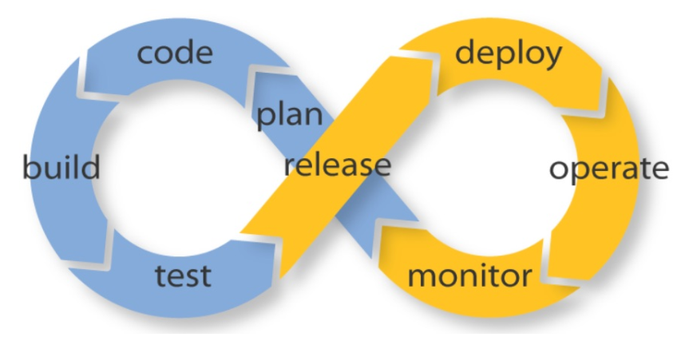
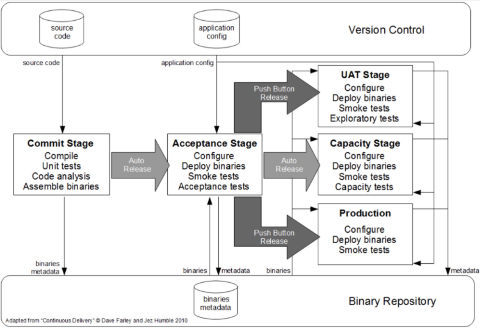
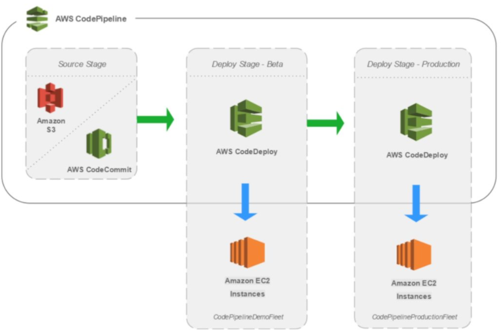
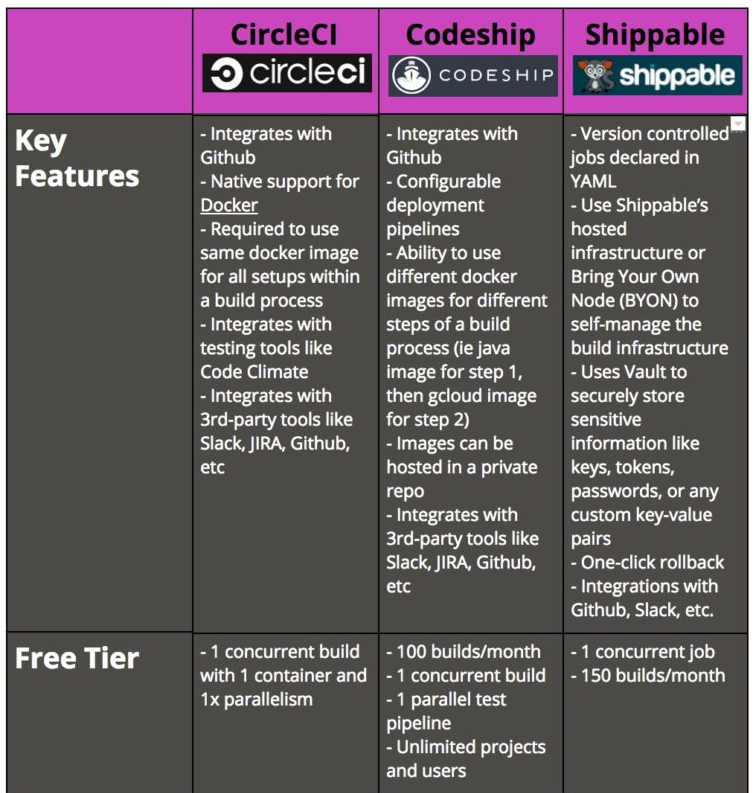

CI/CD 的出现改变了开发人员和测试人员发布软件的方式。本文是描述这一变化的系列文章第一篇，
这些文章将提供各种工具和流程的讲解，以帮助开发人员更好的使用 CI/CD。

从最初的 [瀑布模型](https://en.wikipedia.org/wiki/Waterfall_model)，
到后来的 [敏捷开发](https://en.wikipedia.org/wiki/Agile_software_development)，
再到今天的 [DevOps](https://aws.amazon.com/devops/what-is-devops/)，
这是现代开发人员构建出色产品的技术路线。
随着 DevOps 的兴起，出现了持续集成，持续交付（CI/CD）和持续部署的新方法，
而传统的软件开发和交付方式在迅速变得过时。过去的敏捷时代里，
大多数公司的软件发布周期是每月、每季度甚至每年（还记得那些日子吗？），
而在现在 DevOps 时代，每周、每天甚至每天多次都是常态。
当 SaaS 成为业界主流后尤其如此，您可以轻松地动态更新应用程序，
而无需强迫用户下载更新组件。很多时候，用户甚至都不会注意到正在发生变化。

开发团队通过软件交付流水线（Pipeline）实现自动化，以缩短交付周期，
大多数团队都有自动化流程来检查代码并部署到新环境。
我们一直在关注自动化测试流程，但这将在之后的文章中介绍。
今天，我们将介绍什么是 CI/CD/CD ，以及现代软件公司如何使用工具将部署代码的流程自动化。

**持续集成**注重将各个开发者的工作集合到一个代码仓库中，通常每天会进行几次，
主要目的是尽早发现集成错误，使团队更加紧密结合，更好地协作。
**持续交付**的目的是最小化部署或发布过程中团队固有的摩擦，
它的实现通常能够将构建部署的每个步骤自动化，以便任何时刻能够安全地完成代码发布（理想情况下）。
**持续部署**是一种更高程度的自动化，无论何时代码有较大改动，
都会自动进行构建／部署。

以上的每一个阶段都是**交付流水线**的一部分。
[Humble 和 Ferley](http://www.informit.com/articles/article.aspx?p=1621865&seqNum=2)
在他们的书作《持续交付：通过自动化构建、测试和部署实现可靠软件版本发布》中解释说：
"对软件的每次更改都要经过一个复杂的过程才能发布，该过程包括多个测试和部署阶段进行软件的构建。
反过来看，这个过程需要许多人之间的合作，甚至可能需要几个团队间合作。
部署流水线对这一过程进行建模，并且它的持续集成和发布管理工具能让您在代码从版本控制转移到各种测试和部署时，
查看和控制每次更改的过程。"

## 持续集成（CI）

通过持续集成，开发人员能够频繁地将其代码集成到公共代码仓库的主分支中。
开发人员能够在任何时候多次向仓库提交作品，而不是独立地开发每个功能模块并在开发周期结束时一一提交。

这里的一个重要思想就是让开发人员更快更、频繁地做到这一点，从而降低集成的开销。
实际情况中，开发人员在集成时经常会发现新代码和已有代码存在冲突。
如果集成较早并更加频繁，那么冲突将更容易解决且执行成本更低。

当然，这里也有一些权衡，这个流程不提供额外的质量保障。
事实上，许多组织发现这样的集成方式开销更大，因为它们依赖人工确保新代码不会引起新的 bug 或者破坏现有代码。
为了减少集成期间的摩擦，持续集成依赖于测试套件和自动化测试。
然而，要认识到自动化测试和持续测试是完全不同的这一点很重要，我们会在文章结尾处详细说明。

CI 的目标是将集成简化成一个简单、易于重复的日常开发任务，
这样有助于降低总体的构建成本并在开发周期的早期发现缺陷。
要想有效地使用 CI 必须转变开发团队的习惯，要鼓励频繁迭代构建，
并且在发现 bug 的早期积极解决。

持续交付（CD）实际上是 CI 的扩展，其中软件交付流程进一步自动化，以便随时轻松地部署到生成环境中。
成熟的持续交付方案也展示了一个始终可部署的代码库。使用 CD 后，软件发布将成为一个没有任何紧张感的例行事件。
开发团队可以在日常开发的任何时间进行产品级的发布，而不需要详细的发布方案或者特殊的后期测试。

CD 集中依赖于部署流水线，团队通过流水线自动化测试和部署过程。此流水线是一个自动化系统，
可以针对构建执行一组渐进的测试套件。CD 具有高度的自动化，并且在一些云计算环境中也易于配置。

在流水线的每个阶段，如果构建无法通过关键测试会向团队发出警报。否则，将继续进入下一个测试，
并在连续通过测试后自动进入下一个阶段。流水线的最后一个部分会将构建部署到和生产环境等效的环境中。
这是一个整体的过程，因为构建、部署和环境都是一起执行和测试的，它能让构建在实际的生产环境可部署和可验证。

AWS 上提供了可靠的当前 CI/CD 的展示，亚马逊是云计算的提供商之一，提供出色的 CI/CD 流水线环境和实验过程，
有众多开发资源可供选择，您可以将它们在一个易于配置和监控的流水线中组合起来。

许多人认为持续交付的吸引力主要在于，它自动化了从提交代码到仓库，再到测试和发布产品过程的所有步骤。
这是构建和测试过程细致的自动化，但是如何发布以及发布什么仍然是需要人工操作，持续部署可以改变这一点。

## 持续部署（CD）

持续部署扩展了持续交付，以便软件构建在通过所有测试时自动部署。在这样的流程中，
不需要人为决定何时及如何投入生产环境。CI/CD 系统的最后一步将在构建后的组件/包退出流水线时自动部署。
此类自动部署可以配置为快速向客户分发组件、功能模块或修复补丁，并准确说明当前提供的内容。

采用持续部署的组织可以将新功能快速传递给用户，得到用户对于新版本的快速反馈，并且可以迅速处理任何明显的缺陷。
用户对无用或者误解需求的功能的快速反馈有助于团队规划投入，避免将精力集中于不容易产生回报的地方。

随着 DevOps 的发展，新的用来实现 CI/CD 流水线的自动化工具也在不断涌现。这些工具通常能与各种开发工具配合，
包括像 GitHub 这样的代码仓库和 Jira 这样的 bug 跟踪工具。此外，随着 SaaS 这种交付方式变得更受欢迎，
许多工具都可以在现代开发人员运行应用程序的云环境中运行，例如 [GCP](https://cloud.google.com/) 和 AWS。

最受欢迎的自动化工具是 [Jenkins](https://jenkins.io/)（以前的 Hudson），
这是一个由数百名贡献者和商业公司 [Cloudbees](https://www.cloudbees.com/) 支持的开源项目。
Cloudbees 甚至聘请了 Jenkins 的创始人，并提供了一些 Jenkins 培训项目和附加组件。
处理开源项目之外，还有一些更现代化的商业产品例如 CircleCI，Codeship 和 Shippable。
这些产品各有优缺点，我鼓励开发人员在开发流程中一一尝试它们，以了解它们在您的环境中的工作方式，
以及它们如何与您的工具、云平台、容器系统等协作。

在 mabl 中，我们在 [Google Cloud Platform 上进行构建](https://www.mabl.com/blog/validating-100-million-pages-kubernetes)，
因此，我们正在寻找与 GSP 兼容或者最好是已经集成进 GSO 的产品。我们尝试过 CircleCI，Codeship 和 Shippable，
下面有一个简单的表格，展示了每个工具的一些细节：

我们最终选择了 [Codeship](http://codeship.com/)，我认为我们的选择是正确的，
也感谢 Codeship 团队的支持。

## 接下来？

一旦部署了现代化的 CI/CD 流水线，您可能会意识到开发人员工作流程中的一些工具和流程也需要进行现代化改造。
测试是一个要着重关注的领域，如果您的部署频率是每天或者一天多次，您的每次测试可能需要数小时甚至一晚上才能完成。
mabl 正在使用机器学习解决这个问题。

