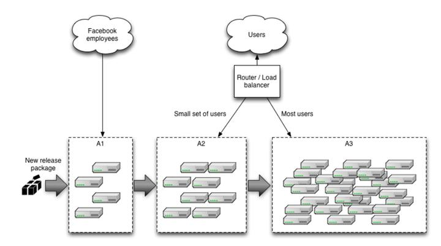
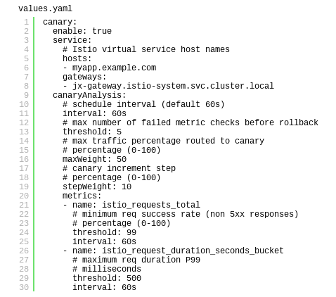
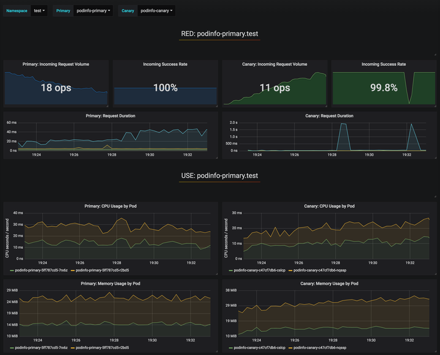

这是渐进式交付系列的第三篇文章，前两篇请参见：
- [Kubernetes 中的渐进式交付：蓝绿部署和金丝雀部署](https://blog.csanchez.org/2019/01/22/progressive-delivery-in-kubernetes-blue-green-and-canary-deployments/)
- [使用 Jenkins X 渐进式交付](https://blog.csanchez.org/2019/01/24/progressive-delivery-with-jenkins-x/)

渐进式交付被 Netflix， Facebook 以及其它公司使用用来减轻部署的风险。
但是现在你可以在使用Jenkins X时采用它。

--------
[渐进式交付](https://redmonk.com/jgovernor/2018/08/06/towards-progressive-delivery/)是持续交付的下一步，它将新版本部署到用户的一个子集，并在将其滚动到全部用户之前对其正确性和性能进行评估，如果不匹配某些关键指标，则进行回滚。

--------
尤其是，我们聚焦金丝雀发布，并让它在你的 Jenkins X 应用中变得易于采用。
金丝雀发布包括向应用程序的新版本发送一小部分流量，并在向其他用户发布之前验证这里没有错误。
Facebook 就是这样做的，首先向内部员工提供新版本，然后是一小部分用户，然后是其他所有用户，但是你要采用它并不需要成为 Facebook ！

你可以[在 Martin Fowler 的网站阅读更多与金丝雀发布相关信息](https://martinfowler.com/bliki/CanaryRelease.html)。

## Jenkins X
如果在 Jenkins X 中你已经有一个应用，那么你知道的你可以 通过 `jx promote myapp --version 1.0 --env production` 命令 promote 它到"生产"环境。
但是，在检查新版本是否失败的同时，它也可以自动并逐步地向一定比例的用户推出。
如果发生失败，应用程序将自动回滚。
整个过程中完全没有人为干预。
------
注意：这个新功能是非常新的，在将来这些步骤将不再需要，因为它们也将由 Jenkins X 自动化了。

------

作为第一步，三个 Jenkins X 插件需要被安装：
- [Istio](https://istio.io/) : [一种服务网格](https://istio.io/docs/concepts/what-is-istio/)容许我们管理我们服务的流量。
- [Prometheus](https://prometheus.io/) ：Kubernetes 中最流行的监控系统。
- [Flagger](https://github.com/stefanprodan/flagger) ：一个使用 Istio 的项目，该项目使用 Prometheus 的指标自动化进行金丝雀发布和回滚。

插件可以使用如下命令安装（使用一个最近版本的 jx CLI ）：
1. jx create addon istio
2. jx create addon prometheus
3. jx create addon flagger

这将在 jx-production 命名空间启动 Istio 来进行指标收集。

现在获取  Istio ingress 的 IP ，并将一个通配符域名（如： *.example.com ）指向它，以便我们可以使用它根据主机名路由多个服务。
Istio ingress 提供了金丝雀发布需要的路由能力（流量转移），传统的 Kubernetes ingress 对象不支持该功能。

集群被配置后，是时候配置我们的应用了。
在 `charts/myapp/templates` 目录下向你的 helm chart 添加一个 [canary.yaml](https://github.com/carlossg/croc-hunter-jenkinsx-serverless/blob/9eea262/charts/croc-hunter-jenkinsx/templates/canary.yaml)。

然后往 `charts/myapp/values.yaml` 追加如下内容，将 `myapp.example.com` 修改为你的主机名或域名：

不久，当你从 Jenkins X 快速开始创建你的应用，将不再需要修改 `canary.yaml` 和 `values.yaml` 这两个文件，因为它们默认启用金丝雀部署。

就这样！现在当使用 `jx promote myapp --version 1.0 --env production` 将你的应用 promote 到生产环境，它将执行一次金丝雀部署。
请注意，第一次被 promote 时，它不会执行金丝雀部署，因为它需要与以前的版本数据进行比较，但从第二次 promotion 开始，它将起作用。

根据上面 `values.yaml` 文件中的配置，它看起来像：
- 第 1 分钟：将 10% 的流量发送到新版本
- 第 2 分钟：将 20% 的流量发送到新版本
- 第 3 分钟：将 30% 的流量发送到新版本
- 第 4 分钟：将 40% 的流量发送到新版本
- 第 5 分钟：将 100% 的流量发送到新版本

如果我们配置的指标（请求持续时间超过 500 毫秒或超过 1% 的响应返回 500 错误）失败，Flagger 将注意到失败，并且如果重复 5 次，它将回滚这次发布，将 100% 的流量发送到旧版本。

获得金丝雀事件输出，执行如下命令：
1. $ kubectl -n jx-production get events --watch\
2. --field-selector involvedObject.kind=Canary
3. 23m ... New revision detected! Scaling up jx-production-myapp.jx-production
4. 22m ... Starting canary analysis forjx-production-myapp.jx-production
5. 22m ... Advance jx-production-myapp.jx-production canary weight 10
6. 21m ... Advance jx-production-myapp.jx-production canary weight 20
7. 20m ... Advance jx-production-myapp.jx-production canary weight 30
8. 19m ... Advance jx-production-myapp.jx-production canary weight 40
9. 18m ... Advance jx-production-myapp.jx-production canary weight 50
10. 18m ... Copying jx-production-myapp.jx-production template spec to jx-production-myapp-primary.jx-production
11. 17m ... Promotion completed! Scaling down jx-production-myapp.jx-production

## 仪表盘
为了可视化的目的，Flagger 包含一个 Grafana 面板，尽管它在金丝雀发布中不需要。
可以在本地通过 Kubernetes 端口转发访问它。

然后使用 `admin/admin` 访问 [http://localhost:3000/](http://localhost:3000/)，选择 `canary-analysis` 面板以及
- namespace 选择 `jx-production`
- primary 选择 `jx-production-myapp-primary`
- canary 选择 `jx-production-myapp`

它将为我们提供当前版本和新版本的对比视图，视图中包含不同指标（CPU，内存，请求持续时间，响应错误……）。

## 附加说明
请注意 Istio 默认地将阻止从你的 Pod 访问外部集群（一种预计将在 Istio 1.1 中发生变化的行为）。
[学习如何控制 Istio ingress 流量](https://istio.io/docs/tasks/traffic-management/egress/)。

如果因为指标失败出现自动回滚，生产环境的 Jenkins X GitOps 仓库会过时，仍然使用新版本而不是旧版本。
这是计划在即将发布的版本中修复的内容。
