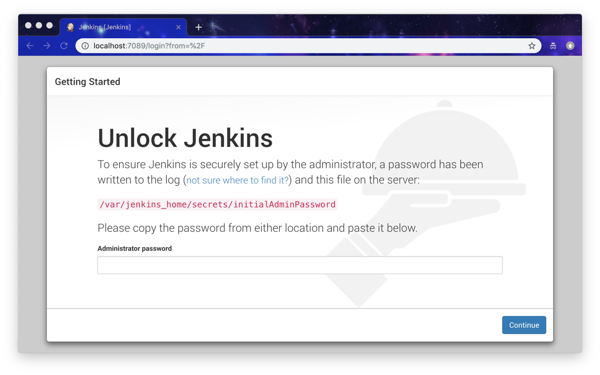
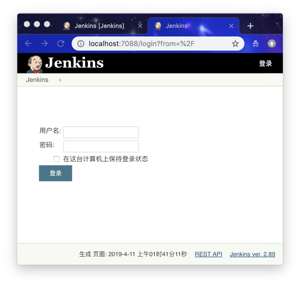
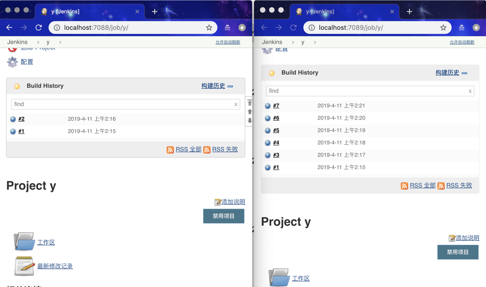
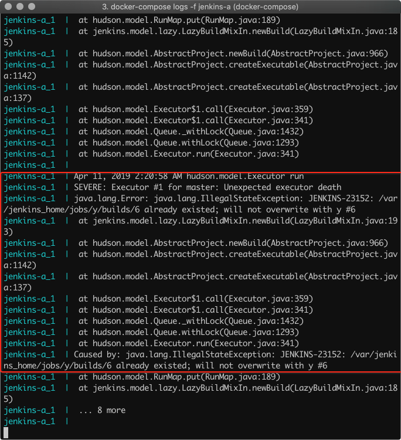

> 审校：[donhui](https://github.com/donhui)，[LinuxSuRen](https://github.com/LinuxSuRen)

Jenkins master 的高可用是个老大难的问题。和很多人一样，笔者也想过两个 Jenkins master 共享同一个 JENKINS_HOME 的方案。了解 Jenkins 原理的人，都会觉得这个方案不可行。但是真的不可行吗？

由于工作原因，笔者需要亲自验证以上猜想。

### JENKINS_HOME 介绍
Jenkins 所有状态数据都存放文件系统的目录中，这个目录被称为 JENKINS_HOME 目录。

### 实验环境介绍
笔者通过 Docker compose 启动两个独立的 Jenkins master，分别为 jenkins-a 和 jenkins-b。它们共用同一个 JENKINS_HOME 目录。相应的代码仓库的链接放在文章底部。

将代码克隆到本地后，进入仓库，执行 `docker-compose up -d` 即可启动实验环境。启动完成，在浏览器中输入 http://localhost:7088 可访问 jenkins-a，jenkins-b 的地址是 http://localhost:7089 。但是你会发现它们启动后的界面显示是不一样的。

jenkins-b 的界面如下图所示：



而 jenkins-a 的界面如下图所示：



这时，将 jenkins-a 日志中的解锁密码（Unlock password）输入到 jenkins-b 的页面中，会得到报错信息：
```
ERROR: The password entered is incorrect, please check the file for the correct password
```

这时，再次 jenkins-b 日志中的解锁密码（Unlock password）输入到表单中即可进入下一步。接下来就是按照提示一步步完成了。在 jenkins-b 安装步骤的最后一步，我们设置了管理员的用户名密码：admin/admin。然后就算完成任务了。

然后我们再在 jenkins-a 使用 admin/admin 进行登录，登录是报错的：用户密码不正确。

接下来，执行 `docker-compose restart jenkins-a` 命令重启 jenkins-a。再次使用 admin/admin 就可以登录成功了。

当两个 Jenkins 启动完成后，接下来开始做实验。

### 实验1：创建任务
在 jenkins-a 创建任务 x，刷新 jenkins-b 的页面，jenkins-b 上会不会显示出任务 x ？

结果：jenkins-b 不会出现任务 x。重启 jenkins-b 后，任务 x 出现在任务列表中。

### 实验2：任务结果可见性
jenkins-a 上任务执行，jenkins-b 上能否看到任务执行结果？

jenkins-a 执行任务 x，并且执行成功。刷新 jenkins-b 看不到任何执行记录。重启 jenkins-b 后，可看到执行记录。

### 实验3：两 master 同时执行同一任务
分别在两个 Jenkins master 上（几乎）开始同一个任务 x。其中一个任务的 build number 会更新，但是另一个不会。

其中 jenkins-a 任务 x 的 build number 会升到 2，而 jenkins-b 保持的是 1。这时，单独执行 jenkins-b 的任务 x，日志会出现错误：

```
jenkins-b_1  | WARNING: A new build could not be created in job x
jenkins-b_1  | java.lang.IllegalStateException: JENKINS-23152: /var/jenkins_home/jobs/x/builds/2 already existed; will not overwrite with x #2
```

### 实验4：编辑任务
jenkins-a 上设置任务 x 定时执行，刷新 jenkins-b 页面，任务 x 中并没有定时执行的设置。重启 jenkins-b 后，任务 x 更新。

### 实验5：定时任务的结果是什么？
如果 jenkins-a 和 jenkins-b 两个任务均为定时任务，而且都生效了。它们运行结果是什么的呢？

看到的现象是，两个任务都会按时执行，但是只有一个任务能将运行结果写入到磁盘中。界面如下图：



另，从日志中，可以确认 jenkins-a 和 jenkins-b 确实按时执行了。如下图日志中，看出 jenkins-a 定时执行 #6 次构建时报错，因为 jenkins-b 已经执行过 #6 次构建了：



### 小结
可以确认的是，当两个 Jenkins 进程共用同一个 JENKINS_HOME 目录时，其中一个 Jenkins 进程更新了 JENKINS_HOME 的内容，另一个是不会实时更新的。所以，同时启动两个 Jenkins master 共用同一个 JENKINS_HOME 的方案是不可行的。我们不能在 jenkins-a 挂了后，直接将流量切到 jenkins-b。因为 jenkins-b 必须重启。

最后结论：多个 Jenkins master 共享同一个 JENKINS_HOME 的方案是无法使用 Jenkins master 的高可用。

### 附录
* Jenkins standby 实验环境：[https://github.com/zacker330/jenkins-standby-experiment](https://github.com/zacker330/jenkins-standby-experiment)