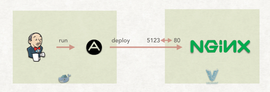
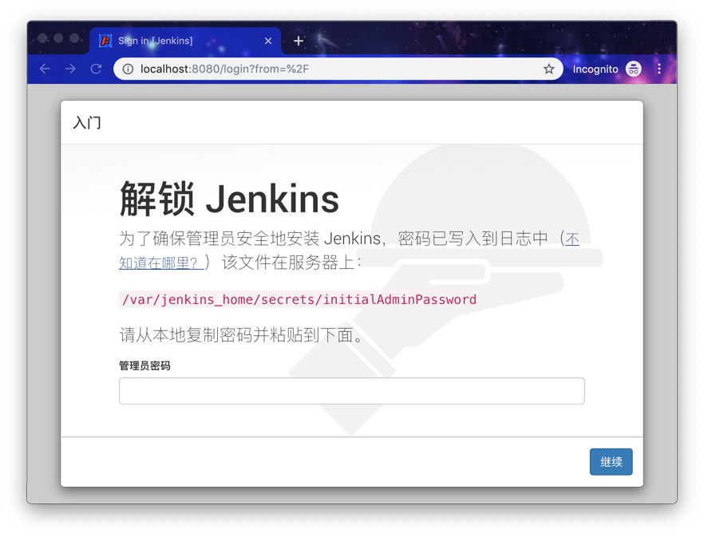
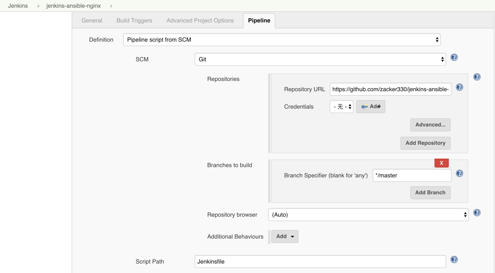
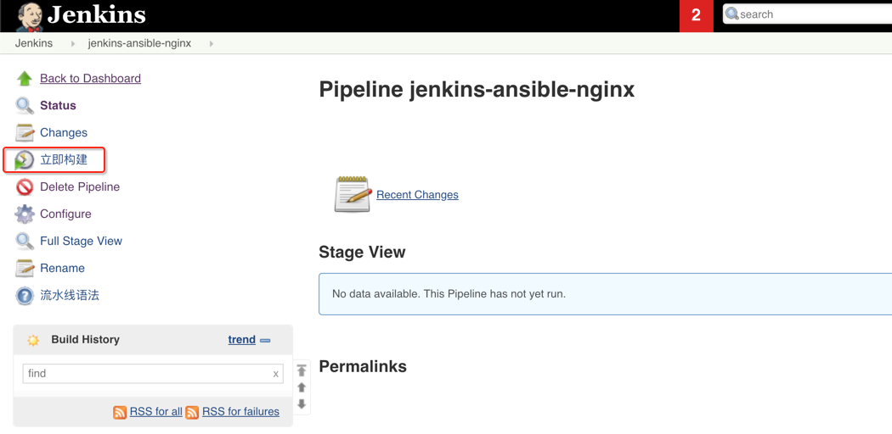
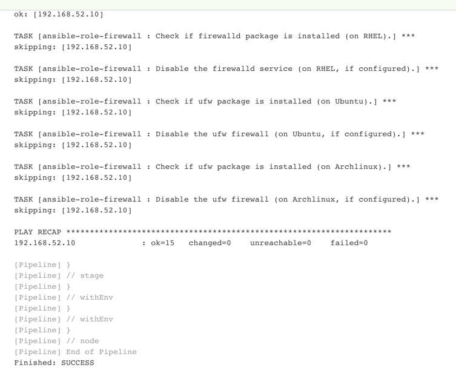
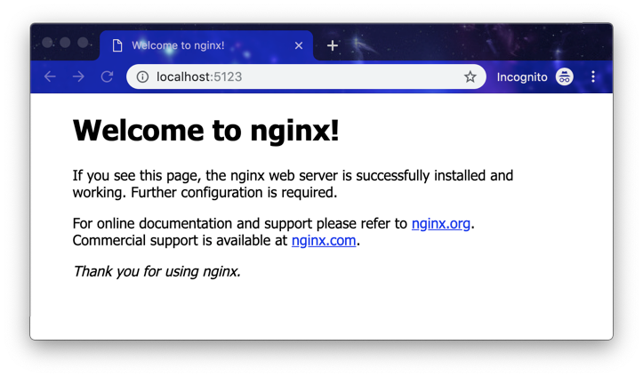
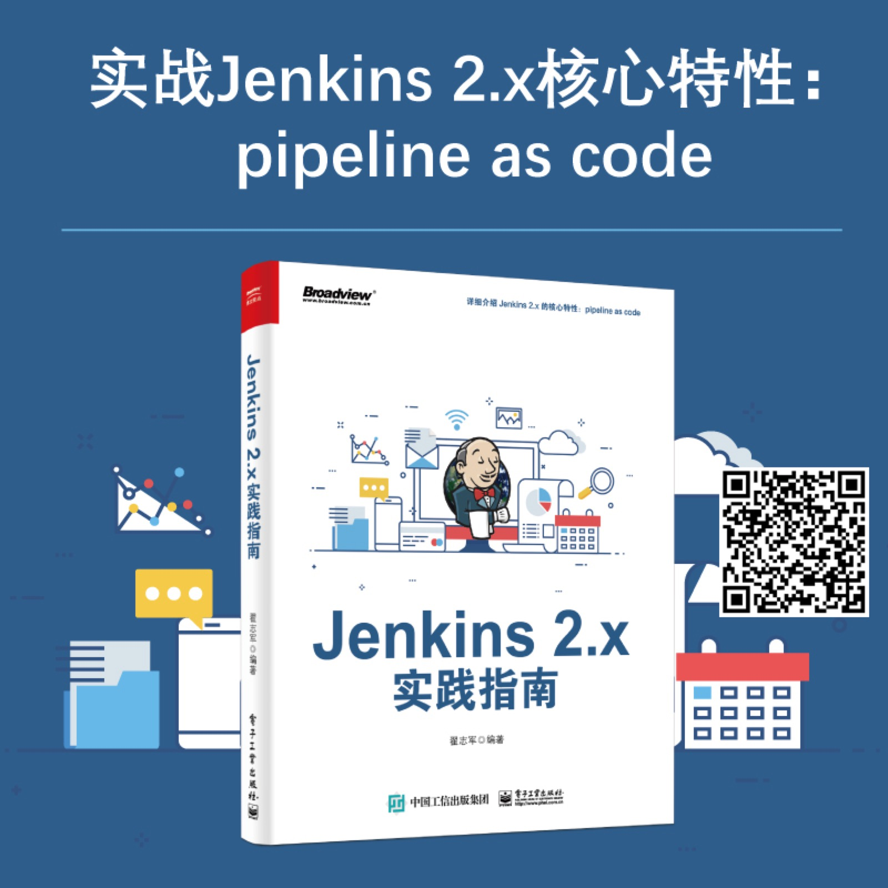

本文介绍如何使用 Jenkins + Ansible 实现对 Nginx 的自动化部署。最终达到的效果有如下几点：
1. 只要你将 Nginx 的配置推送到 GitHub 中，Jenkins 就会自动执行部署，然后目标服务器的 Nginx 配置自动生效。这个过程是幂等（idempotent）的，只要代码不变，执行多少遍，最终效果不变。
2. 如果目标机器没有安装 Nginx，则会自动安装 Nginx。
3. 自动设置服务器防火墙规则。

## 1. 实验环境介绍
本次实验使用 Docker Compose 搭建 Jenkins 及 Jenkins agent。使用 Vagrant 启动一台虚拟机，用于部署 Nginx。使用 Vagrant 是可选的，读者可以使用 VirtualBox 启动一个虚拟机。使用 Vagrant 完全是为了自动化搭建实验环境。

以下是整个实验环境的架构图：


注意，图中的 `5123 <-> 80` 代表将宿主机的 5123 端口请求转发到虚拟机中的 80 端口。

* [Vagrant](https://vagrantup.com)：虚拟机管理工具，通过它，我们可以使用文本来定义、管理虚拟机。
* [Ansible](https://www.ansible.com/)：自动化运维工具
* [Docker Compose](https://docs.docker.com/compose/)：它是一个用于定义和运行多容器 Docker 应用程序的工具。可以使用YAML文件来配置应用程序的服务。

## 2. 启动实验环境
1. 克隆代码并进入文件夹
    ```bash
    git clone https://github.com/zacker330/jenkins-ansible-nginx.git
    cd jenkins-ansible-nginx
    ```
2. 构建 Jenkins agent 的镜像
     需要自定义 Jenkins agent 镜像有两个原因：
     1. 本次实验，使用 Swarm 插件实现 Jenkins master  与 Jenkins agent 之间的通信，所以 Jenkins agent 需要启动 swarm 客户端。
     2. Jenkins agent 必须支持 Ansible。
    ```bash
   docker build -f JenkinsSlaveAnsibleDockerfile -t jenkins-swarm-ansible .
    ```
3. 启动 Jenkins master 及 Jenkins agent
    ```bash
    docker-compose up -d
    ```
   通过 `http://localhost:8080` 访问 Jenkins master，如果出现“解锁密码”页面，如下图，则执行命令 `docker-compose logs jenkins` 查看 Jenkins master 启动日志。将日志中的解锁密码输入到表单中。然后就一步步按提示安装即可。
    
4. 安装 Jenkins 插件
    本次实验需要安装以下插件：
    * Pipeline 2.6：[https://plugins.jenkins.io/workflow-aggregator](https://plugins.jenkins.io/workflow-aggregator) 
    * Swarm 3.15：[https://plugins.jenkins.io/swarm](https://plugins.jenkins.io/swarm)
      用于 实现 Jenkins master 与 Jenkins agent 自动连接
    * Git 3.9.3：[https://plugins.jenkins.io/git](https://plugins.jenkins.io/git)
5. 配置 Jenkins master 不执行任务
    进入页面：[http://localhost:8080/computer/(master)/configure](http://localhost:8080/computer/(master)/configure)，如下图所示设置：


6. 确认 Jenkins 安全配置有打开端口，以供 Jenkins agent 连接。
    我们设置 Jenkins master 开放的端口，端口可以是固定的 50000 ，也可以设置为随机。设置链接：[http://localhost:8080/configureSecurity/](http://localhost:8080/configureSecurity/)。
    

7. 启动目标机器，用于部署 Nginx
    在命令行中执行以下命令：
    ```bash
    vagrant up 
     ```
    注意，Vagrantfile 文件中的 `config.vm.box` 值必须改成你的 vagrant box 。

至此，实验环境已经搭建好了。接下来就可以新建 Jenkins 任务了。

## 3. 在 Jenkins 上创建部署任务
1. 新建流水线任务
    
2. 配置流水线
    配置 Jenkins 任务从远程仓库拉取 Jenkinsfile，如下图所示：
    
    除此之外，不需要其它配置了，是不是很简单？
## 4. 手工触发一次自动化构建
  点击“立即构建”：
  
  最终执行日志如下：
  

至此，部署已经完成。以后修改 Nginx 的配置，只需要修改代码，然后推送到远程仓库，就会自动化部署。不需要手工登录到目标机器手工修改了。

最后，我们可以通过访问 `http://localhost:5123`，如果出现如下页面说明部署成功：



## 5. 代码讲解
以上步骤并不能看出自动化部署真正做了什么。那是因为我们所有的逻辑都写在代码中。是的，可以说是 **everything is code**。

接下来我们介绍代码仓库。

```bash
% tree -L 2
├── JenkinsSlaveAnsibleDockerfile # Jenkins agent 镜像 Dockerfile
├── Jenkinsfile  # 流水线逻辑
├── README.md
├── Vagrantfile # Vagrant 虚拟机定义文件
├── docker-compose.yml # Jenkins 实现环境
├── env-conf # 所有应用配置
│   └── dev   # dev 环境的配置
├── deploy  # Ansible 部署脚本所在文件夹
│   ├── playbook.yaml
│   └── roles
└── swarm-client.sh # Jenkins swarm 插件的客户端
```
### 5.1流水线逻辑
Jenkinsfile 文件用于描述整条流水线的逻辑。代码如下：
```groovy
pipeline{
  // 任务执行在具有 ansible 标签的 agent 上
  agent { label "ansible"}
  environment{
     // 设置 Ansible 不检查 HOST_KEY 
    ANSIBLE_HOST_KEY_CHECKING = false
  }
  triggers {
     pollSCM('H/1 * * * *')
  }
  stages{
    stage("deploy nginx"){
      steps{
        sh "ansible-playbook -i env-conf/dev  deploy/playbook.yaml"
      }
}}}
```
* `environment` 部分：用于定义流水线执行过程中的环境变量。
* `triggers` 部分：用于定义流水线的触发机制。`pollSCM` 定义了每分钟判断一次代码是否有变化，如果有变化则自动执行流水线。
* `agent` 部分：用于定义整条流水线的执行环境。
* `stages` 部分：流水线的所有阶段，都被定义在这部分。

以上只是定义流水线是如何执行的，目前整条流水线只有一个 `deploy nginx` 阶段，并且只执行了一条 `ansible-playbook` 命令。但是它并没有告诉我们部署逻辑是怎么样的。

### 5.2 部署逻辑
所有的部署逻辑，包括 Nginx 的安装启动、配置的更新以及加载，都放在 Ansible 脚本中。对 Ansible 不熟的同学，可以在本文末尾找到介绍 Ansible 的文章。

整个部署逻辑的入口在 `deploy/playbook.yaml`，代码如下：
```yaml
---
- hosts: "nginx"
  become: true
  roles:
    # Nginx 的部署
    - ansible-role-nginx
    # 对防火墙的设置
    - ansible-role-firewall
```
* `hosts`：定义了 playbook 部署的目标主机分组名为 `nginx`。
* `roles`：包含了两个执行具体部署动作的 role，至于 role 内部逻辑，不在本文讨论范围，有兴趣的同学阅读源码。

### 5.3 配置管理
谈到部署，就不得不谈配置管理。

回顾前文中流水线中执行的 shell 命令：`ansible-playbook -i env-conf/dev  deploy/playbook.yaml` 我们通过 `-i` 参数指定部署时所使用的环境配置。通过这种方式实现环境配置与执行脚本的分离。这样带来以下几个好处：
1. 新增环境时，只需要复制现有的环境，然后将里面的变量的值改成新环境的即可。比如，要对测试环境进行部署，只需要将 `-i` 参数值改成：`env-conf/test`。
2. 对配置版本化控制。

本次实验中，各个环境的配置放在 `env-conf` 目录中，目前只有 dev 环境，以下是 `env-conf/` 目录结构：
```bash
% cd env-conf/
% tree
└── dev
    ├── group_vars
    │   └── nginx.yaml
    ├── host_vars
    │   └── 192.168.52.10
    └── hosts
```
* hosts文件：Ansible 中通过“分组”来实现对主机的管理。hosts 文件内容如下：
  ```
  [nginx]
  192.168.52.10
  ```
* host_vars 目录：用于存放主机级别的配置变量，本例中 `192.168.52.10` 是一个 YAML 格式文件。注意文件名是该主机的 IP。我们在文件中放主机相关的配置，比如 Ansible 连接主机时使用到的用户名和密码。
* group_vars 目录：用于存放组级别的配置变量。比如 nginx.yaml 对应的就是 `nginx` 这个组的的配置变量。文件名与 `hosts` 中的组名对应。

### 总结
到此，我们完整的自动化部署已经讲解完成。但是还遗留下一些问题：
1. 本文只是安装了一个“空”的 Nginx，但是没有介绍 Nginx 真正配置。
2. 目前主机的连接信息（SSH 密码）是明文写在 `host_vars/192.168.52.10` 文件中的，存在安全风险。
3. 没有介绍如何当 Java 应用部署时，如何自动更新 Nginx 的配置。

本文属于使用 Jenkins + Ansible 实现自动化部署的入门文章，笔者将根据读者的反馈决定是否写续集。

如果觉得本文讲的 Jenkins 流水线逻辑部分不够过瘾，可以考虑入手一本最近才出版的《Jenkins 2.x实践指南》。长按下图进行扫码购买。




### 附录
* 本次实验环境代码：[https://github.com/zacker330/jenkins-ansible-nginx](https://github.com/zacker330/jenkins-ansible-nginx)
* 简单易懂Ansible系列 —— 解决了什么：[https://showme.codes/2017-06-12/ansible-introduce/](https://showme.codes/2017-06-12/ansible-introduce/)
* Puppet，Chef，Ansible的共性：[https://showme.codes/2016-01-02/the-nature-of-ansible-puppet-chef/](https://showme.codes/2016-01-02/the-nature-of-ansible-puppet-chef/)
