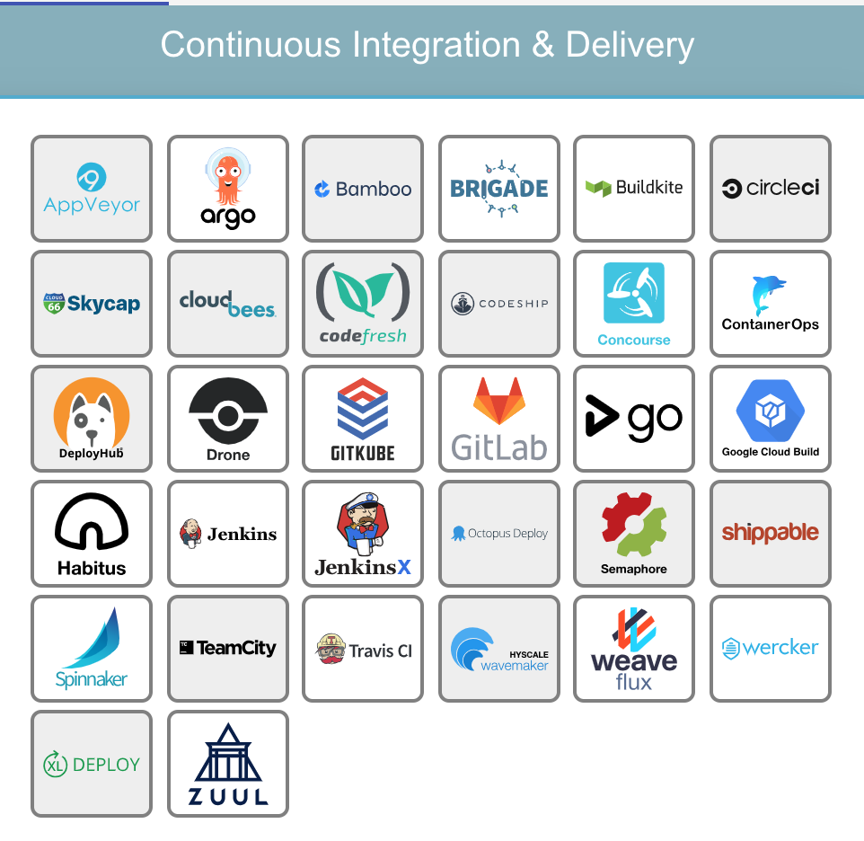
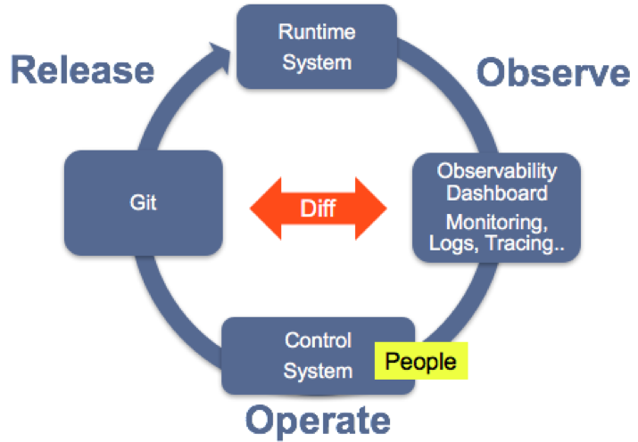
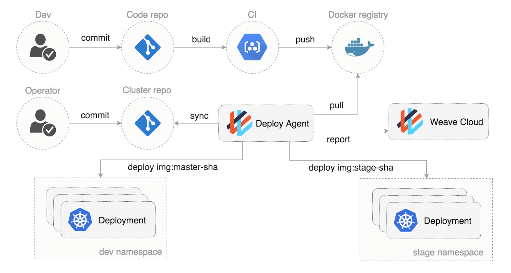

在我们正在进行的 Kubernetes FAQ 系列中，我们回答了社区中一些常见的问题，本周我们将讨论在选择 CI/CD 工具时需要考虑什么。

目前已经有大量的 CI/CD 工具可供选择-开源解决方案和商业解决方案。在这里，我们重点介绍在设置持续交付流水线时要考虑的一些最重要的注意事项。

在这篇文章中你将学到：
- 为什么需要自动化流水线
- 部署典型流水线的组件
- CD 流水线功能需要考虑
- 如何合并 GitOps

## 为什么要创建自动化 CI/CD 流水线？
自动化 CI/CD 流水线有许多好处：
- 将您的上线时间从数周或数月减少到数天或数小时。通过自动化流水线，开发团队可以提高发布的速度以及代码的质量。以小增量连续添加的新功能和修复可以使产品具有更少的缺陷。
- 一个强大的开发团队。由于交付流水线的所有阶段都可供团队中的任何人检查、改进和验证，因此可以创建对构建的所有权，从而鼓励整个组织的强大团队合作和协作能力。
- 降低软件开发的风险和成本。自动化鼓励开发人员在继续前进之前分阶段验证代码更改，从而减少了缺陷最终出现在生产中的机会。
- 减少进展中的工作量。CD 流水线提供从开发到客户的快速反馈循环。这个迭代周期不仅可以帮助您构建正确的产品，而且还允许开发人员更快地进行产品改进，从而减少正在进行的工作。

## 典型的部署流水线
CD 流水线由几个不同的阶段组成; 一个工具不能满足所有这些步骤。

以下是构成大多数自动化流水线的步骤：
1. 在笔记本电脑上编写代码，将其推入源代码仓库(如 Git)。
2. 代码通过单元、集成和其他自动化测试。如果测试通过，将构建成新的 Docker 镜像。
3. 将镜像推送到镜像仓库。
4. 将新镜像推送到集群中。

## 思考 CD 流水线的特性
创建流水线的困难之一是成功地将您想要使用的工具粘合在一起。这些是为流水线选择工具时要考虑的主要功能：
- 端到端的安全性
- 能够使用完全可重现的审计跟踪进行回滚
- 内置可观察性和警报功能
- 平均快速部署时间以及平均快速恢复时间
- 简单的开发人员经验和工作流程

### 流水线端到端的安全性
在[市场上的 CI/CD 工具]((https://www.weave.works/technologies/cicd-tools/))中，有些工具将 CI 和 CD 部分合并为一个工具。或者更糟糕的是，那些负责创建 CI/CD 流水线的人将组装一系列手工锻造的脚本，这些脚本可以在一个方向上通过流水线推送代码，或执行被称为[CIOP 流水线](https://www.weave.works/blog/kubernetes-anti-patterns-let-s-do-gitops-not-ciops)。

出于多种原因，您不希望这样做。这是一种反模式，因为集群安全和其他凭据不在集群之外，这可能是不安全的。建议的方法是使用实​​现 Kubernetes Operator 的工具。

部署到集群的 Kubernetes Operator 可以监视仓库中的新镜像。更进一步，如果您的整个集群状态（通过声明性清单）都保存在 Git 中，那么“diff alert”可以成为从仓库中“提取”新镜像并将其部署到集群的动力。这不仅是一种更安全的部署方法，而且还为开发人员提供了一种更简单的方法来应用和回滚生产环境的更改。

### 具备完整审计跟踪回滚
跟踪差异历史记录，以及在团队中处理大型应用程序时管理新旧部署的回滚可能具有挑战性。您需要一个可以轻松处理此类方案的工具。如果您拥有一个完全可审计的路径，它可以帮助您了解何时何时执行了哪些操作，这也有助于 SOC 2合规性规定的增加。

### 可观察性和警报
将可观察性纳入您的流水线意味着什么？

为了提高你的速度，你的流水线需要结合可观察性来回答这些问题：

如果自动发布更改，我怎么知道它是否有效？
在复杂的分布式系统中，我如何理解问题、诊断问题并管理事件 - 尤其是当您需要回滚时？
将持续交付与实时可观察性相结合，使您的开发团队能够在部署新功能之前做出更好的决策。

新功能和补丁被推送到 Git 并触发部署流水线，当它们准备好发布时，理想情况下应该对正在运行的集群实时监控。这允许开发人员根据反馈做出决策。可以将它们返回到流水线的起点，或将更新后的镜像部署到生产集群中。

### 更快的平均部署和恢复时间
除了能够频繁可靠地部署之外，还需要考虑考虑一个重要场景，是在集群宕机时的恢复。这需要快速、平滑，并且可能由可能不是由 Kubernetes 专业的开发人员来执行。

### 简单的开发人员经验和 Git 工作流程
为了在当今的云原生世界中快速发展，开发人员必须从端到端控制流水线。提交凭据等待人来回复的时期已经没有了。从开发人员一直使用的工具构建流水线是有意义的。像 Git 这样的工具。

使用 GitOps，有三个基本原则：

#### ＃1.所有可以描述的内容都必须存储在 Git 中
通过使用 Git 作为事实源，可以观察集群并将其与所需的状态进行比较。目标是描述所有内容：策略、代码、配置，甚至监控事件和版本控制。将所有内容保持在版本控制之下，可以增强收敛性，如果最初它们没有成功，则可以重新应用更改。

#### ＃2.不要直接使用 kubectl
一般来说，使用命令行工具 kubectl 直接部署到集群不是一个好主意。许多人让他们的 CI 工具推动部署，但是这样做可能会对生产环境遭受更容易被攻击的风险。

#### ＃3.使用遵循操作符模式的 Kubernetes Operator
使用遵循操作符模式的 Kubernetes Operator，您的集群始终通过其签入 Git 的配置文件与“事实源”保持同步。由于集群的所需状态保存在 Git 中，因此还可以观察到与正在运行的集群的差异。

## 将 GitOps 工作流程应用于流水线
通过采用 GitOps，开发人员可以通过提取请求管理基础架构配置和软件部署以及回滚。当真实来源与集群中运行的不同时，集群会自动与 Git 中保存的内容同步。

Weave Cloud 的部署代理在集群内部运行。这意味着容器映像注册表和集群 API 的凭据永远不会离开集群的域。通过使用 Git 作为事实源，可以比较和警告所需的状态和当前状态。这不仅可以确保集群保持最新，而且还可以在集群崩溃时提供从灾难中快速恢复的方法。
