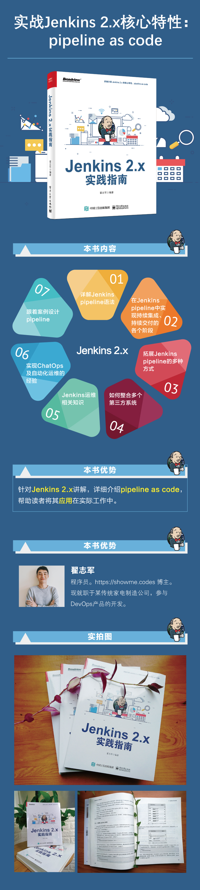

Jenkins 中文社区是一个开放、包容、活跃的社区，包含大量的 Jenkins 干货。

当然，它也会为公众号的粉丝发放福利。

本次福利是《Jenkins 2.x实践指南》x 5，以下是介绍：

本次活动书籍均由博文视点（Broadview）提供，特此感谢。

### 参与方式：
1. 关注本公众号，关在后台回复【抽奖】，根据二维码进入小程序抽奖。
2. 开奖时间为：5月19日晚上9点自动开奖（记得填自己的手机号，地址以便中奖后邮寄发出）。

以下是本公众号二维码：

还可以扫二维码直接购买：
