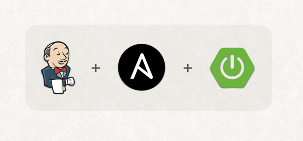
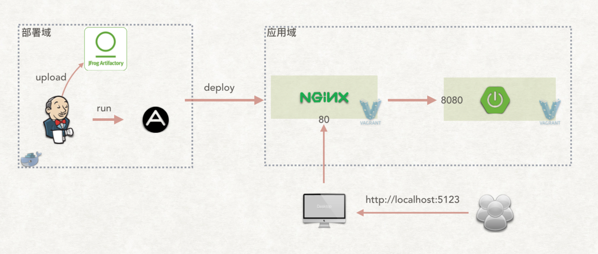

本文要点：
1. 设计一条 Springboot 最基本的流水线：包括构建、制品上传、部署。
1. 使用 Docker 容器运行构建逻辑。
1. 自动化整个实验环境：包括 Jenkins 的配置，Jenkins slave 的配置等。

##1. 代码仓库安排
本次实验涉及以下多个代码仓库：
```
% tree -L 1
├── 1-cd-platform # 实验环境相关代码
├── 1-env-conf # 环境配置代码-实现配置独立
└── 1-springboot # Springboot 应用的代码及其部署代码
```

1-springboot 的目录结构如下：
```
% cd 1-springboot
% tree -L 1 
├── Jenkinsfile # 流水线代码
├── README.md
├── deploy # 部署代码
├── pom.xml 
└── src # 业务代码
```

所有代码，均放在 GitHub: [https://github.com/cd-in-practice](https://github.com/cd-in-practice)

##2. 实验环境准备
笔者使用 Docker Compose + Vagrant 进行实验。环境包括以下几个系统：
* Jenkins * 1
   Jenkins master，全自动安装插件、默认用户名密码：admin/admin。
* Jenkins agent * 2
   Jenkins agent 运行在 Docker 容器中，共启动两个。
* Artifactory * 1
  一个商业版的制品库。笔者申请了一个 30 天的商业版。

使用 Vagrant  是为了启动虚拟机，用于部署 Springboot 应用。如果你的开发机器无法使用 Vagrant，使用 VirtualBox 也可以达到同样的效果。但是有一点需要注意，那就是网络。如果在虚拟机中要访问 Docker 容器内提供的服务，需要在 DNS 上或者 hosts 上做相应的调整。所有的虚拟机的镜像使用 Centos7。

另，接下来笔者的所有教程都将使用 Artifactory 作为制品库。**在此申明，笔者没有收 JFrog——研发 Artifactory 产品的公司——任何广告费。** 笔者只是想试用商业产品，以便了解商业产品是如何应对制品管理问题的。

启动 Artifactory 后，需要添加 “Virtual Repository” 及 “Local Repository”。具体请查看 Artifactory 的官方文档。如果你当前使用的是 Nexus，参考本教程，做一些调整，问题也不大。

如果想使用已有制品库，可以修改 1-cd-platform 仓库中的 [settings-docker.xml](https://github.com/cd-in-practice/1-cd-platform/blob/master/settings-docker.xml) 文件，指向自己的制品库。

实验环境近期的总体结构图如下：



之所以说是“近期的”，是因为上图与本篇介绍的结构有小差异。本篇文章还没有介绍 Nginx 与 Springboot 配置共用，但是总体不影响读者理解。

##3. Springboot 应用流水线介绍
Springboot 流水线有两个阶段：
1. 构建并上传制品
2. 部署应用

流水线的所有逻辑都写在 [Jenkinsfile](https://github.com/cd-in-practice/1-springboot/blob/master/Jenkinsfile) 文件。接下来，分别介绍这两个阶段。

###3.1 构建并上传制品
此阶段核心代码：
```groovy
docker.image('jenkins-docker-maven:3.6.1-jdk8')
.inside("--network 1-cd-platform_cd-in-practice -v $HOME/.m2:/root/.m2") {
    sh """
      mvn versions:set -DnewVersion=${APP_VERSION}
      mvn clean test install
      mvn deploy
    """
}
```
它首先启动一个装有 Maven 的容器，然后在容器内执行编译、单元测试、发布制品的操作。

而 `mvn versions:set -DnewVersion=${APP_VERSION}` 的作用是更改 `pom.xml` 文件中的版本。这样就可以实现每次提交对应一个版本的效果。

###3.2 部署应用
> 注意： 这部分需要一些 Ansible 的知识。

首先看部署脚本的入口 [1-springboot/deploy/playbook.yaml](https://github.com/cd-in-practice/1-springboot/blob/master/deploy/playbook.yaml)：

```yaml
---
- hosts: "springboot"
  become: yes
  roles:
    - {"role": "ansible-role-java", "java_home": "{{JAVA_HOME}}"}
    - springboot
```
先安装 JDK，再安装 springboot。JDK 的安装，使用了现成 Ansible role: [https://github.com/geerlingguy/ansible-role-java](https://github.com/geerlingguy/ansible-role-java)。

重点在 springboot 部署的核心逻辑。它主要包含以下几部分：

1. 创建应用目录。
1. 从制品库下载指定版本的制品。
1. 生成 Systemd service 文件（实现服务化）。
1. 启动服务。

以上步骤实现在 [1-springboot/deploy/roles/springboot](https://github.com/cd-in-practice/1-springboot/tree/master/deploy/roles/springboot) 中。

流水线的部署阶段的核心代码如下：
```groovy
docker.image('williamyeh/ansible:centos7').inside("--network 1-cd-platform_cd-in-practice") {

  checkout([$class: 'GitSCM', branches: [[name: "master"]], doGenerateSubmoduleConfigurations: false,
            extensions: [[$class: 'RelativeTargetDirectory', relativeTargetDir: "env-conf"]], submoduleCfg: [],
            userRemoteConfigs: [[url: "https://github.com/cd-in-practice/1-env-conf.git"]]])

  sh "ls -al"

  sh """
    ansible-playbook --syntax-check deploy/playbook.yaml -i env-conf/dev
    ansible-playbook deploy/playbook.yaml -i env-conf/dev --extra-vars '{"app_version": "${APP_VERSION}"}'
  """
}
```

它首先将配置变量仓库的代码 clone 下来，然后对 playbook 进行语法上的检查，最后执行 `ansible-playbook` 命令进行部署。`--extra-vars` 参数的 `app_version ` 用于指定将要部署的应用的版本。

### 3.3 实现简易指定版本部署
在 [1-springboot/Jenkinsfile](https://github.com/cd-in-practice/1-springboot/blob/master/Jenkinsfile) 中实现了简易的指定版本部署。核心代码如下：
1. 流水线接受参数
```groovy
parameters { string(name: 'SPECIFIC_APP_VERSION', 
defaultValue: '', description: '') }
```
2. 如果指定了版本，则跳过构建阶段，直接执行部署阶段
```groovy
stage("build and upload"){
      // 如果不指定部署版本，则执行构建
      when {
        expression{ return params.SPECIFIC_APP_VERSION == "" }
      }
      // 构建并上传制品的逻辑
      steps{...}
}
```
之所以说是“简易”，是因为部署时只指定了制品的版本，并没有指定的部署逻辑和配置的版本。这三者的版本要同步，部署才真正做到准确。

##4. 配置管理
所有的配置项都放在 [1-env-conf](https://github.com/cd-in-practice/1-env-conf) 仓库中。Ansible 执行部署时会读取此仓库的配置。

将配置放在 Git 仓库中有两个好处：
1. 配置版本化。
2. 任何配置的更改都可以被审查。

有好处并不代表没有成本。那就是开发人员必须开始关心软件的配置（笔者发现不少开发者忽视配置项管理的重要性。）。

本文重点不在配置管理，后面会有文章重点介绍。

##5. 实验环境详细介绍
事实上，整个实验，工作量大的地方有两处：一是 Springboot 流水线本身的设计；二是整个实验环境的自动化。读者朋友之所以能一两条简单的命令就能启动整个实验环境，是因为笔者做了很多自动化的工作。笔者认为有必要在本篇介绍这些工作。接下来的文章将不再详细介绍。

###5.1 解决流水线中启动的 Docker 容器无法访问 http://artifactory

流水线中，我们需要将制品上传到 artifactory（settings.xml 配置的仓库地址是 http://artifactory:8081），但是发现无法解析 host。这是因为流水线中的 Docker 容器所在网络与 Docker compose 创建的网络不同。所以，解决办法就是让流水线中的 Docker 容器加入到 Docker compose 的网络。

具体解决办法就是在启动容器时，加入参数：`--network 1-cd-platform_cd-in-practice`

###5.2 Jenkins 初次启动初始化

在没有做任何设置的情况启动 Jenkins，会出现一个配置向导。这个过程必须是手工的。笔者希望这一步也是自动化的。Jenkins 启动时会执行 `init.groovy.d/`目录下的 Groovy 脚本。

###5.3 虚拟机中如何能访问到 http://artifactory ？

http://artifactory 部署在 Docker 容器中。Springboot 应用的制品要部署到虚拟机中，需要从 http://artifactory 中拉取制品，也就是要在虚拟机里访问容器里提供的服务。虚拟机与容器之间的网络是不通的。那怎么办呢？笔者的解决方案是使用宿主机的 IP 做中转。具体做法就是在虚拟机中加一条 host 记录：
```ruby
machine.vm.provision "shell" do |s|
    s.inline = "echo '192.168.52.1 artifactory' >> /etc/hosts"
end
```
以上是使用了 Vagrant 的 `provision` 技术，在执行命令 `vagrant up` 启动虚拟机时，就自动执行那段内联 shell。`192.168.52.1` 是虚拟宿主机的 IP。所以，虚拟机里访问 http://artifactory:8081 时，实际上访问的是 http://192.168.52.1:8081。

网络结构可以总结为下图：


## 后记
目前遗留问题：
1. 部署时制品版本、配置版本、部署代码版本没有同步。
2. Springboot 的配置是写死在制品中的，没有实现制品与配置项的分离。

这些遗留问题在后期会逐个解决。就像现实一样，经常需要面对各种遗留项目的遗留问题。

## 附录
1. 使用 Jenkins + Ansible 实现自动化部署 Nginx：[https://showme.codes/2019-04-22/jenkins-ansible-nginx/](https://showme.codes/2019-04-22/jenkins-ansible-nginx/)
2. 简单易懂Ansible系列 —— 解决了什么[https://showme.codes/2017-06-12/ansible-introduce/](https://showme.codes/2017-06-12/ansible-introduce/)