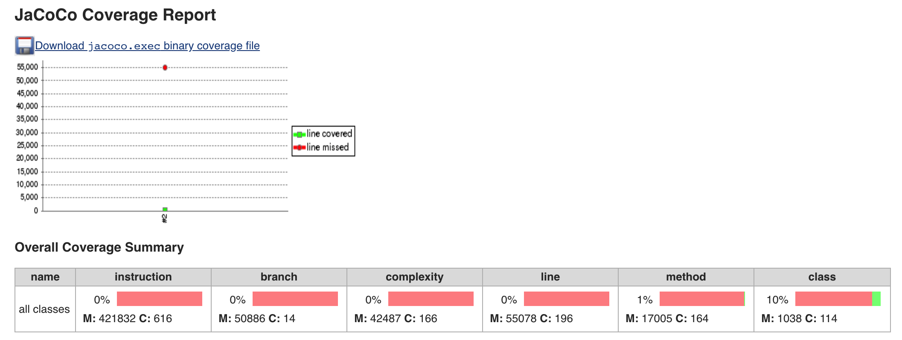

## 使用 JaCoCo 统计功能测试代码覆盖率？
对于 JaCoCo，有所了解但又不是很熟悉。
"有所了解"指的是在 CI 实践中已经使用 JaCoCo 对单元测试代码覆盖率统计：
当代码 push 到代码仓库后，用 JaCoCo 进行单元测试代码覆盖率统计，并将相应数据推送到 SonarQube。
"不是很熟"指的是应用场景也仅限于此，并未进行过多研究与实践。

前不久，有测试同事提出，想要在实际测试时，用 JaCoCo 统计功能测试代码覆盖率。
其主要目的是在经过功能测试后，通过查看代码覆盖率统计的相关指标，增强对软件质量的信心。
经查阅资料，证明这是可行的。

由于对 JaCoCo 不甚了解，于是查阅官网资料对 JaCoCo 进一步了解。

## 进一步了解 JaCoCo
[JaCoCo](https://www.eclemma.org/jacoco/index.html)，即 Java Code Coverage，是一款开源的 Java 代码覆盖率统计工具。
它由 EclEmma 团队根据多年来使用和集成现有库的经验教训而创建。

### JaCoCo 愿景
JaCoCo 应该为基于 Java VM 的环境中的代码覆盖率分析提供标准技术。
重点是提供一个轻量级的、灵活的、文档良好的库，以便与各种构建和开发工具集成。

### JaCoCo 产品功能
- 指令(C0)、分支(C1)、行、方法、类型和圈复杂度的覆盖率分析。
- 基于 Java 字节码，因此也可以在没有源文件的情况下工作。
- 通过基于 Java agent 的实时检测进行简单集成。其他集成场景(如自定义类加载器)也可以通过 API 实现。
- 框架无关性：平稳地与基于 Java VM 的应用程序集成，比如普通 Java 程序、OSGi 框架、web 容器或 EJB 服务器。
- 兼容所有已发布的 Java 类文件版本。
- 支持不同的 JVM 语言。
- 支持几种报告格式( HTML、XML、CSV )。
- 远程协议和 JMX 控件，以便在任何时间点从覆盖率 agent 请求执行数据 dump 。
- Ant 任务，用于收集和管理执行数据并创建结构化覆盖报告。
- Maven 插件，用于收集覆盖信息并在Maven构建中创建报告。

### 非功能特性
- 使用简单和与现有构建脚本和工具集成。
- 良好的性能和最小的运行时开销，特别是对大型项目。
- 轻量级实现，对外部库和系统资源的依赖性最小。
- 全面的文档。
- 完整文档化的 API ( JavaDoc ) 和用于与其他工具集成的示例。
- 回归测试基于 JUnit 测试用例，具有完整的功能测试覆盖率。

对 JaCoCo 可以与现有构建脚本和工具进行集成这里做进一步说明：
官方提供了 Java API、Java Agent 、CLI、Ant 、Maven、Eclipse 这几种集成方式；
第三方提供了诸如与 Gradle、IDEA、Jenkins 等其它工具的集成方式。

## 抛开理论，开始实践

JaCoCo 不仅支持统计本地服务的代码覆盖率，也支持统计远程服务的代码覆盖率。
单元测试覆盖率统计就是统计本地服务的代码覆盖率，代码和运行的服务在一台机器上，笔者这里通过使用 JaCoCo Maven 插件完成的。
而功能测试代码覆盖率统计则是统计远程服务的代码覆盖率，代码和运行的服务一般不在一台机器上，这里需要借助 JaCoCo Java agent 实现。
> 备注：实际上，JaCoCo Maven 插件也使用了 JaCoCo Java agent，不过用户不需要直接关系 Java agent 及其选项，Maven 插件都透明地处理了。

### 1、下载 JaCoCo 分发包
可以从 [JaCoCo 官网](https://www.eclemma.org/jacoco/)下载分发包，也可以从 Maven 仓库（中央仓库或私服）下载。
分发包的 lib 目录下，包括以下库：

### 2、Java 应用启动脚本添加 jacocoagent 相关 JVM 参数
需要将 jacocoagent.jar 推送到部署应用的服务器上，笔者这里用 Ansible 进行了批量推送。
Java 应用启动脚本需要加入类似下面的 JVM 参数：
```
JAVA_OPTS="$JAVA_OPTS -javaagent:/path/jacocoagent.jar=includes=*,output=tcpserver,append=false,address=$IP,port=$JACOCO_PORT"
```
这样在应用成功启动后，会暴露一个 TCP 服务，客户端可以连接到这个服务并获取执行数据文件。

相关属性说明如下：
- append：其中 append=false 表示 dump 每次会生成一个新的执行数据文件，如果 append=true，dump 时则会将数据追加到已存在的执行数据文件。
其中 output=tcpserver 表示 agent 监听来自被 adrress 和 port 属性指定的TCP 端口的连接，执行数据被写到这个连接； 
- output：如果 output=tcpclient 则表示在启动时，agent 连接到被 adrress 和 port 属性指定的TCP 端口，执行数据被写到这个连接；
如果 output=file 则表示在 JVM 终止时，执行数据被写到被 destfile 属性指定的文件。output 默认值为 file 。
- address：当 output 为 tcpserver 时绑定到的 IP 地址或主机名，或者当 output 为 tcpclient 时连接到的 IP 地址或主机名。
在 tcpserver 模式下，值为“*”导致代理只接受本机地址上的连接。address 默认值为 127.0.0.1 。
- port：当 output 方式为 tcpserver 时绑定到该端口，或者当 output 方式为 tcpclient 时连接到该端口。
在 tcpserver 模式下，端口必须可用，这意味着如果多个 JaCoCo agent 在同一台机器上运行，则必须指定不同的端口。port 默认值为 6300 。

### 3、创建及配置 Jenkins Pipeline 任务
Jenkins 任务大致有几个步骤：拉取代码，构建，dump 应用执行数据（ jacoco.exec ），生成代码覆盖率报告。
拉取代码这里无需多说，配置下从代码仓库（SVN/Git）和分支地址就可以了，比较简单。
构建这里用了 Jenkins Pipeline Maven Integration Plugin ，笔者这里所用的 Maven 命令是 mvn clean package -Dmaven.test.skip=true 。
dump 应用执行数据这里有多种方式：Ant、CLI、Maven，因为Java 应用是用 Maven 构建的，这里选择了 Maven Jacoco Plugin。
生成代码覆盖率报告笔者这里使用了 Jenkins Jacoco Plugin。

Jenkins Pipeline 案例如下：
```
pipeline {
    agent any
    stages {
        stage('Checkout'){
            steps{
                git branch: '${GIT_BRANCH}', credentialsId: 'xxx-xxx-xx-xx-xxx', url: '${GIT_URL}'
            }
        }
        stage('Build') {
            steps{
                withMaven(maven: 'maven'){
                      sh "mvn clean package -Dmaven.test.skip=true"
                }
            }
        }
        stage('DumpFromServer'){
            steps {
                withMaven(maven: 'maven'){
                      sh 'mvn org.jacoco:jacoco-maven-plugin:0.8.4:dump -Djacoco.address=${SERVER_IP} -Djacoco.port=${JACOCO_PORT}'
                }
            }
        }
        stage('JacocoPublisher') {
            steps {
                 jacoco()
            }
        }
    }
}
```
Jacoco 覆盖率报告，部分截图如下：



## 总结
笔者所实现的方式并未覆盖任何场景，但是大同小异，相关工具的使用详情可以查看官网文档，因为它是最全面的。
笔者希望这个实践能给有类似诉求的同行一些参考，当然笔者也希望能够和大家互相交流。
同时笔者的 JaCoCo 实践之路并未结束，可能在使用的过程中会有一些问题需要解决，
后续也将考虑使用 Jenkins API 为需要统计功能测试代码覆盖率的 Java 应用实例自动生成一个对应的 Jenkins 任务，
并在 Java 应用实例销毁后，对相应的 Jenkins 任务进行清理等其它功能。

## 参考
- https://www.eclemma.org/jacoco/index.html
- https://www.jacoco.org/jacoco/trunk/doc/integrations.html
- https://www.jacoco.org/jacoco/trunk/doc/agent.html
- https://www.jacoco.org/jacoco/trunk/doc/counters.html
- https://www.eclemma.org/jacoco/trunk/doc/mission.html