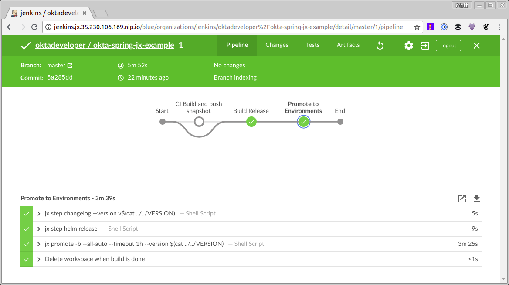
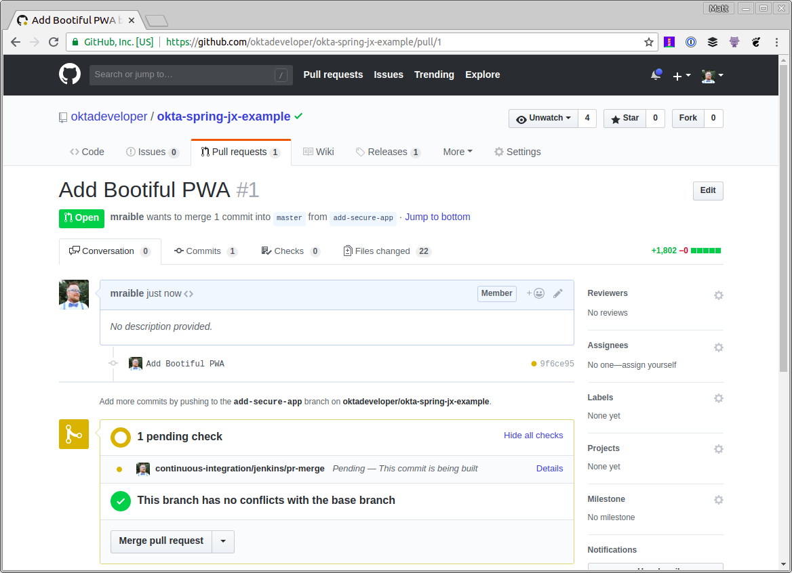
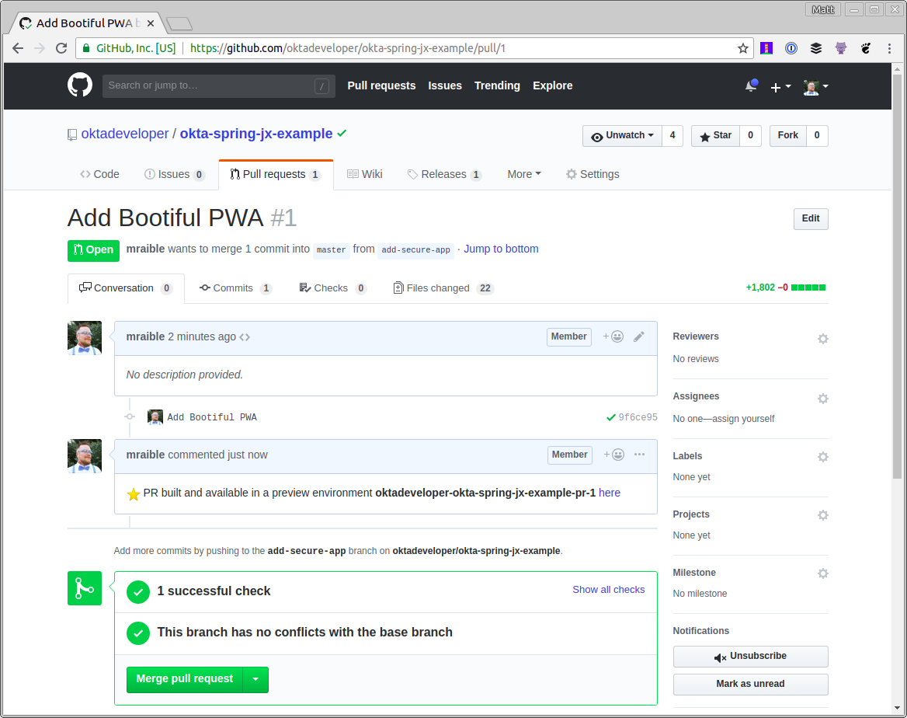
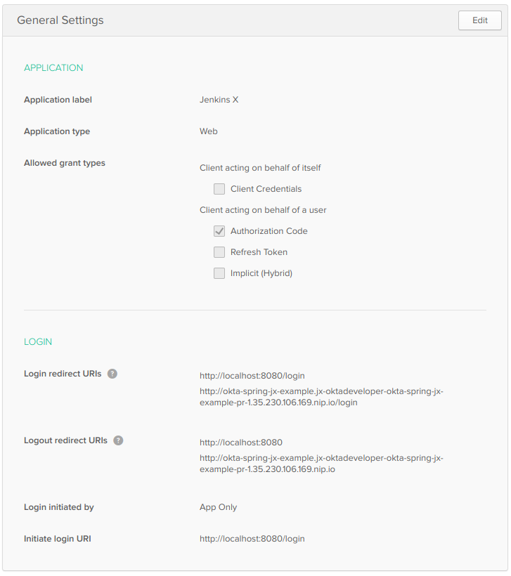
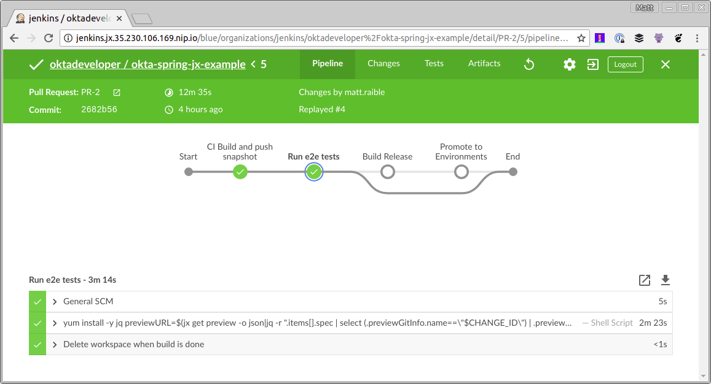

过去五年中的变化，如迁移到公有云以及从虚拟机向容器的转变，已经彻底改变了构建和部署软件的意义。

以 Kubernetes 为例。Google 于2014年开源，现在所有主流的公有云供应商都支持它---它为开发人员提供了一种很好的方式，可以将应用程序打包到 Docker 容器中，并部署到任意 Kubernetes 集群中。

## 使用 CI/CD、Kubernetes 和 Jenkins X 进行高性能开发
在技术上，高性能团队几乎总是成功的必要条件，而持续集成、持续部署(CI/CD)、小迭代以及快速反馈是构建模块。为你的云原生应用程序设置 CI/CD 可能比较困难。通过自动化所有内容，开发人员可以花费宝贵的时间来交付实际的业务。

如何使用容器、持续交付和 Kubernetes 成为高效团队？这就是 Jenkins X 的切入点。
--------
“Jenkins X 的理念是为所有开发人员提供他们自己的海军航海管家，可以帮助你航行持续交付的海洋。” -  James Strachan
--------
Jenkins X 帮助你自动化你在 Kubernetes 中的 CI/CD - 你甚至不需要学习 Docker 或 Kubernetes！

## Jenkins X 能做什么？
Jenkins X 在 Kubernetes 上自动安装，配置和升级 Jenkins 和其他应用程序（Helm，Skaffold，Nexus 等）。它使用 Docker 镜像、Helm 图表和流水线来自动化应用程序的 CI/CD。它使用 GitOps 来管理环境之间的升级，并通过在拉取请求和生产时对其进行评论来提供大量反馈。

## Jenkins X 入门
要安装 Jenkins X，首先需要在你的机器或云供应商上安装 `jx` 二进制文件。从 Google Cloud 可以获得300美元的积分，所以我决定从那里开始。

## 在 Google Cloud 上安装 Jenkins X 并创建群集
浏览到[cloud.google.com](https://cloud.google.com)并登录。如果你还没有帐户，请注册免费试用。转到控制台（右上角有一个链接）并激活 Google Cloud shell。将以下命令复制并粘贴到 shell 中。
```
curl -L https://github.com/jenkins-x/jx/releases/download/v1.3.79/jx-linux-amd64.tar.gz | tar xzv
sudo mv jx /usr/local/bin
```

注意：Google Cloud Shell 将在一小时后终止在你的主目录之外所做的任何更改，因此你可能必须重新运行这些命令。好消息是它们将在你的历史中，所以你只需要向上箭头并进入。你也可以删除上面的 `sudo mv` 命令，并将以下内容添加到 `.bashrc` 中。
```
export PATH=$PATH:.
```

使用以下命令在 GKE（Google Kubernetes Engine）上创建集群。你可能必须为你的帐户[启用 GKE](https://console.cloud.google.com/projectselector/kubernetes)。
```
jx create cluster gke --skip-login
```

如果系统提示你下载 `helm`，请确认你要安装。系统将提示你选择 Google Cloud Zone。我建议选择一个靠近你的位置。我选择 `us-west1-a`，因为我住在 **Denver, Colorado** 附近。对于 Google Cloud Machine 类型，我选择了 `n1-standard-2` 并使用了 min（3）和 max（5）个节点数的默认值。

对于 GitHub 名称，键入你自己的（例如 `mraible`）和你在 GitHub 上注册的电子邮件（例如 `matt.raible@okta.com`）。我试图使用 `oktadeveloper`（一个 GitHub 组织），但我无法使其工作。

注意：如果你的帐户启用了两步认证，则 GitHub 集成将失败。如果你希望成功完成该过程，则需要在 GitHub 上禁用它。

当提示安装 ingress controller 时，按 **Enter** 键 **确定**。再次按 **Enter** 键选择默认 domain。

系统将提示你创建 GitHub API Token。单击 [提供的 URL](https://github.com/settings/tokens/new?scopes=repo,read:user,read:org,user:email,write:repo_hook,delete_repo) 并将其命名为 “Jenkins X”。将 token 值复制并粘贴回控制台。

在安装完成后喝杯咖啡、饮料或做一些俯卧撑。可能需要几分钟。

下一步是将 API token 从 Jenkins 复制到你的控制台。按照控制台中提供的说明进行操作。

完成后，运行 `jx console` 并单击链接以登录到 Jenkins 实例。单击 Administration 并升级 Jenkins 及其所有插件（插件管理器 > 滚动到底部并选择全部）。如果未能执行此步骤，将无法从 GitHub pull request 到 Jenkins X CI 进程。

## 创建一个 Spring Boot 应用程序
当我第一次开始使用 Jenkins X 时，我尝试导入现有项目。即使我的应用程序使用了 Spring Boot，但是根目录中没有 `pom.xml`，所以 Jenkins X 认为它是一个 Node.js 应用程序。出于这个原因，我建议首先创建一个空白的 Spring Boot 应用程序，以保证 Jenkins X 正确创建。

从 Cloud Shell 创建一个简单的 Spring Boot 应用程序：
```
jx create spring -d web -d actuator
```

此命令使用 [Spring Initializr](https://start.spring.io/)，因此系统会提示你进行一些选择。以下是我的选择：

| QUESTION | ANSWER |
| ------ | ------ |
| Language | java |
| Group | com.okta.developer |
| Artifact | okta-spring-jx-example |


提示：为你的 artifact name 选取一个简洁的名称将减轻你的痛苦。Jenkins X 对于版本名称有53个字符的限制，`oktadeveloper/okta-spring-boot-jenkinsx-example` 将会使它超过两个字符。

为 git 用户名、初始化 git 和提交消息都选择默认值。如果你不想使用个人帐户，可以选择要使用的组织。运行以下命令以查看应用程序的 CI/CD 流水线。
```
jx get activity -f okta-spring-jx-example -w
```

运行 `jx console`，单击生成的链接，然后导航到你的项目(如果你想要一个更富视觉效果的视图)。




此过程将执行一些任务：

1. 为你的项目创建一个[版本](https://github.com/oktadeveloper/okta-spring-jx-example/releases/tag/v0.0.1)。
2. 为演示环境项目创建 [pull request](https://github.com/mraible/environment-marespring-staging/pull/1)。
3. 将其自动部署到演示环境，以便你可以查看它的运行情况。
```
Merge status checks all passed so the promotion worked!
Application is available at: http://okta-spring-jx-example.jx-staging.35.230.106.169.nip.io
```

注意：由于 Spring Boot 默认情况下不提供欢迎页面，所以打开上面的 URL 时将返回404。

## 使用 Jenkins X 将 Spring Boot 应用程序部署到生产环境中
默认情况下，Jenkins X 只会自动部署到演示环境。你可以手动改进从[演示到生产](http://jenkins-x.io/developing/promote/)使用：
```
jx promote okta-spring-jx-example --version 0.0.1 --env production
```

你可以使用 `jx edit environment` 更改生产环境，以使用自动部署。

既然你已经知道如何使用 Jenkins X 和一个简单的 Spring Boot 应用程序，让我们来看看如何通过一个更实际的示例使其工作。

## 保护你的 Spring Boot 应用程序并添加 Angular PWA
在过去的几个月里，我写了一系列有关使用 Ionic/Angular 和 Spring Boot 构建 PWA（渐进式 Web 应用程序）的博文。

1. 使用 Okta 保护你的加密货币财富跟踪 PWA
2. 使用 Okta（而不是本地存储）安全地存储用户的数据
3. 使用 WireMock、Jest、Protractor 和 Travis CI 测试 Spring Boot API 和 Angular 组件的 Hitchhiker 指南
4. 将你的 Spring Boot + Angular PWA 部署为一个 Artifact
这是该系列的最后一篇博客文章。我相信这是一个真实应用程序的很好的例子，因为它有许多单元和集成测试，包括与 Protractor 的端到端测试。让我们看看如何使用 Jenkins X 和 Kubernetes 自动化生产路径！

克隆刚刚从GitHub创建的Spring Boot项目（确保在URL中更改{yourUsername}）：
```
git clone https://github.com/{yourUsername}/okta-spring-jx-example.git okta-jenkinsx
```

在邻近目录中，将创建的具有 Spring Boot + Angular 的项目克隆为一个 artifact：
```
git clone https://github.com/oktadeveloper/okta-spring-boot-angular-auth-code-flow-example.git spring-boot-angular
```

在终端中，导航到 `okta-jenkinsx` 并删除不再需要的文件：
```
cd okta-jenkinsx
rm  -rf .mvn src mvnw* pom.xml
```

结果应该是包含以下文件的目录结构：
```
$ tree .
.
├── charts
│   ├── okta-spring-jx-example
│   │   ├── Chart.yaml
│   │   ├── Makefile
│   │   ├── README.md
│   │   ├── templates
│   │   │   ├── deployment.yaml
│   │   │   ├── _helpers.tpl
│   │   │   ├── NOTES.txt
│   │   │   └── service.yaml
│   │   └── values.yaml
│   └── preview
│       ├── Chart.yaml
│       ├── Makefile
│       ├── requirements.yaml
│       └── values.yaml
├── Dockerfile
├── Jenkinsfile
└── skaffold.yaml

4 directories, 15 files
```

将 `spring-boot-angular` 所有文件复制到 `okta-jenkinsx`。
```
cp  -r ../spring-boot-angular/* .
```

使用 Travis CI 测试此应用程序时，我运行了 `npm install` 作为该过程的一部分。使用 Jenkins X，使用一个容器（例如 `maven` 或者 `nodejs`）保存所有内容更简单，因此在 frontend-maven-plugin（在 `holdings-api/pom.xml`）中添加执行以运行 `npm install` （提示：你将需要执行 `id==’npm install'` 添加到现有的pom.xml中）。

现在是 `okta-jenkinsx` 在 IntelliJ IDEA、Eclipse、Netbeans 或 VS Code 等 IDE 中作为项目打开目录的好时机！


```
<plugin>
   <groupId>com.github.eirslett</groupId>
   <artifactId>frontend-maven-plugin</artifactId>
   <version>${frontend-maven-plugin.version}</version>
   <configuration>
       <workingDirectory>../crypto-pwa</workingDirectory>
   </configuration>
   <executions>
       <execution>
           <id>install node and npm</id>
           <goals>
               <goal>install-node-and-npm</goal>
           </goals>
           <configuration>
               <nodeVersion>${node.version}</nodeVersion>
           </configuration>
       </execution>
       <execution>
           <id>npm install</id>
           <goals>
               <goal>npm</goal>
           </goals>
           <phase>generate-resources</phase>
           <configuration>
               <arguments>install --unsafe-perm</arguments>
           </configuration>
       </execution>
       ...
   </executions>
</plugin>
```

注意：`--unsafe-perm` 标志是必要的，因为 Jenkins X [以 root 用户身份运行构建](https://github.com/sass/node-sass/issues/941)。我从 [node-sass 的故障排除说明](https://github.com/sass/node-sass/blob/master/TROUBLESHOOTING.md#cannot-find-module-rootinstalljs)中找到了这个解决方案。

## 增加 Actuator 并关闭 HTTPS
Jenkins X 依靠 Spring Boot 的 Actuator 进行健康检查。这意味着如果你不将其包含在你的项目中（或有 `/actuator/health` 防护），Jenkins X 会报告你的应用程序启动失败。

将 Actuator starter 作为依赖项添加到 `holdings-api/pom.xml` 中：
```
<dependency>
   <groupId>org.springframework.boot</groupId>
   <artifactId>spring-boot-starter-actuator</artifactId>
</dependency>
```

你还需要允许访问其运行健康检查。Jenkins X 将部署你的应用程序在一个 NGINX 服务器中,因此你也需要强制关闭 HTTPS，否则你将无法访问你的应用程序。修改 `holdings-api/src/main/java/.../SecurityConfiguration.java` 以允许 `holdings-api/src/main/java/.../SecurityConfiguration.java` 和删除 `requiresSecure()`。

```java
public class SecurityConfiguration extends WebSecurityConfigurerAdapter {
   @Override
   public void configure(WebSecurity web) throws Exception {
       web.ignoring().antMatchers("/**/*.{js,html,css}");
   }
   @Override
   protected void configure(HttpSecurity http) throws Exception {
       http
               .csrf().csrfTokenRepository(CookieCsrfTokenRepository.withHttpOnlyFalse())
           .and()
               .authorizeRequests()
               .antMatchers("/", "/home", "/api/user", "/actuator/health").permitAll()
               .anyRequest().authenticated();
   }
}
```


## 调整 Dockerfile 和 Jenkinsfile 中的路径
由于此项目构建在子目录而不是根目录中，因此请更新  `./Dockerfile` 以查找 `holdings-api` 文件。
```
FROM openjdk:8-jdk-slim
ENV PORT 8080
ENV CLASSPATH /opt/lib
EXPOSE 8080
# copy pom.xml and wildcards to avoid this command failing if there's no target/lib directory
COPY holdings-api/pom.xml holdings-api/target/lib* /opt/lib/
# NOTE we assume there's only 1 jar in the target dir
# but at least this means we don't have to guess the name
# we could do with a better way to know the name - or to always create an app.jar or something
COPY holdings-api/target/*.jar /opt/app.jar
WORKDIR /opt
CMD ["java", "-jar", "app.jar"]
```

你还需要更新 Jenkinsfile,以便它可以运行 `holdings-api` 目录中的任何 `mvn` 命令。也添加  `-Pprod` 配置文件。例如：


```
// in the 'CI Build and push snapshot' stage
steps {
 container('maven') {
   dir ('./holdings-api') {
     sh "mvn versions:set -DnewVersion=$PREVIEW_VERSION"
     sh "mvn install -Pprod"
   }
 }
 ...
}
// in the 'Build Release' stage
dir ('./holdings-api') {
  sh "mvn versions:set -DnewVersion=\$(cat ../VERSION)"
}
...
dir ('./holdings-api') {
  sh "mvn clean deploy -Pprod"
}
```

这应该足以让这个应用程序与 Jenkins X 一起使用。但是，除非你有一个 Okta 帐户并相应地配置它，否则你将无法登录它。

## 为什么使用Okta？
简而言之，我们使[标识管理](https://developer.okta.com/product/user-management/)比你可能习惯的更简洁、更安全、更具可扩展性。Okta 是一种云服务，允许开发人员创建、编辑和安全存储用户帐户和用户帐户数据，并将其与一个或多个应用程序相连接。我们的 API 使你能够：

* 对用户进行[身份验证](https://developer.okta.com/product/authentication/)和[授权](https://developer.okta.com/product/authentication/)
* 存储关于用户的数据
* 执行基于密码和[社交登录](https://developer.okta.com/authentication-guide/social-login/)
* 使用[多重身份验证](https://developer.okta.com/use_cases/mfa/)保护应用程序 
* 了解更多！查看我们的[产品文档](https://developer.okta.com/documentation/)
你心动了吗？注册一个永远免费的开发者帐户，当你完成后，请返回，以便我们可以通过 Spring Boot 和 Jenkins X 了解有关 CI/CD 的更多信息！

## 在 Okta 中为 Spring Boot 应用程序创建一个 Web 应用程序
完成设置过程后，登录到你的帐户并导航到 **Applications > Add Application**。单击 **Web** 和 **下一步**。在下一页中，输入以下值并单击 **Done** (必须单击 **Done**，然后编辑以修改注销重定向 **URI**)。

* 应用名称： `Jenkins X`
* 默认 URI： `http://localhost:8080`
* 登录重定向 URI： `http://localhost:8080/login`
* 注销重定向 URI： `http://localhost:8080`
打开 `holdings-api/src/main/resources/application.yml` 并将你 org/app 中的值粘贴到其中。
```
okta:
 client:
   orgUrl: https://okta.okta.com
   token: XXX
security:
   oauth2:
     client:
       access-token-uri: https://okta.okta.com/oauth2/default/v1/token
       user-authorization-uri: https://okta.okta.com/oauth2/default/v1/authorize
       client-id: {clientId}
       client-secret: {clientSecret}
     resource:
       user-info-uri: https://okta.okta.com/oauth2/default/v1/userinfo
```

你将注意到 `token` 值是 `xxx`。这是因为我更喜欢从环境变量中读取它，而不是签入源代码控制。你可能也想为你的客户密钥执行此操作，但我只是为了简洁而做一个属性。要创建 API token：

1. 导航到 **API** > **Tokens**  ，然后单击 **Create Token**
2. 为令牌命名（例如 “Jenkins X”），然后将其值设置为 `OKTA_CLIENT_TOKEN` 环境变量。
你需要在组织的用户配置文件中添加一个 `holdings` 属性，以便将你的加密货币存储在 Okta 中。导航到 **Users** > **Profile Editor**。点击 **Profile** 表格中的第一个配置文件。你可以通过其 Okta 标识来识别它。单击 **Add Attribute** 并使用以下值：

* 显示名称： `Holdings`
* 变量名： `holdings`
* 描述： `Cryptocurrency Holdings`
执行这些步骤后，你应该能够导航到 `http://localhost:8080`, 并在运行以下命令后登录：
```
cd holdings-api
./mvnw -Pprod package
java -jar target/*.jar
```

在 Jenkins X 中存储 Secrets
在本地存储环境变量非常简单。但是你如何在 Jenkins X 中做到这一点？看看它的凭证功能就知道了。下面是使用方法:

1. 在 Google Cloud Shell 上运行 `jx console`，以获取 Jenkins X 网址
2. 单击该链接，登录，然后单击顶部的 **Administration**
3. 单击 **Credentials** > **(global)** > **Add Credentials**（在左侧）
4. 从下拉列表中选择 **Secret text**，并为 ID 输入 OKTA_CLIENT_TOKEN
5. 将 Okta API token 复制/粘贴到 **Secret** 字段中
当你在里面，添加 secrets：`OKTA_APP_ID`、`E2E_USERNAME` 和 `E2E_PASSWORD`。第一个是你创建的 `Jenkins X` OIDC 应用程序的 ID。您可以通过在 Okta 上导航到您的应用程序并从 URL 复制值来获得它的值。该  `E2E-*` 密钥应该是要用来运行终端到终端（Protractor）测试的凭证。你可能想为此创建一个新用户。

你可以通过将这些值添加到  `environment` 顶部附近的部分来访问 `Jenkinsfile` 中的这些值  。
```
environment {
  ORG               = 'mraible'
  APP_NAME          = 'okta-spring-jx-example'
  CHARTMUSEUM_CREDS = credentials('jenkins-x-chartmuseum')
  OKTA_CLIENT_TOKEN = credentials('OKTA_CLIENT_TOKEN')
  OKTA_APP_ID       = credentials('OKTA_APP_ID')
  E2E_USERNAME      = credentials('E2E_USERNAME')
  E2E_PASSWORD      = credentials('E2E_PASSWORD')
}
```

## 将环境变量转移到 Docker 容器
要将 `OKTA_CLIENT_TOKEN` 环境变量转移到 Docker 容器，请查看：
```
sh "make preview"
```

并将其更改为：
```
sh "make OKTA_CLIENT_TOKEN=\$OKTA_CLIENT_TOKEN preview"
```

此时，你可以创建分支，提交更改，并验证 Jenkins X 中的所有内容是否正常工作。
```
cd ..
git checkout -b add-secure-app
git add .
git commit -m "Add Bootiful PWA"
git push origin add-secure-app
```

打开浏览器并导航到 GitHub 上的存储库并创建 pull request。创建后它应该如下所示。



如果你的 pull request 测试通过，你应该能看到一些绿色标记和 Jenkins X 的评论，说明你的应用程序在预览环境中可用。



如果你单击**此处**链接并尝试登录，则可能会从 Okta 得到一个错误，指出重定向 URI 尚未列入白名单。

## 在 Okta 中自动添加重定向 URI
当你在 Okta 中创建应用程序并在本地运行它们时，很容易知道应用程序的重定向 URI 将是什么。对于这个特定的应用程序，它们将 http://localhost:8080/login 用于登录，http://localhost:8080 用于注销。当您进入生产环境时，URL通常也是众所周知的。但是，使用 Jenkins X，URL 是动态的，并根据你的 pull request 编号动态创建的。

要使用 Okta 进行此操作，你可以创建一个 Java 类，该类与 Okta API 进行交互。创建 `holdings-api/src/test/java/.../cli/AppRedirectUriManager.java` 并使用以下代码完善它。
```java
package com.okta.developer.cli;
import com.okta.sdk.client.Client;
import com.okta.sdk.lang.Collections;
import com.okta.sdk.resource.application.OpenIdConnectApplication;
import org.slf4j.Logger;
import org.slf4j.LoggerFactory;
import org.springframework.beans.factory.annotation.Value;
import org.springframework.boot.ApplicationArguments;
import org.springframework.boot.ApplicationRunner;
import org.springframework.boot.SpringApplication;
import org.springframework.boot.autoconfigure.SpringBootApplication;
import java.util.LinkedHashSet;
import java.util.List;
import java.util.Set;
@SpringBootApplication
public class AppRedirectUriManager implements ApplicationRunner {
   private static final Logger log = LoggerFactory.getLogger(AppRedirectUriManager.class);
   private final Client client;
   @Value("${appId}")
   private String appId;
   @Value("${redirectUri}")
   private String redirectUri;
   @Value("${operation:add}")
   private String operation;
   public AppRedirectUriManager(Client client) {
       this.client = client;
   }
   public static void main(String[] args) {
       SpringApplication.run(AppRedirectUriManager.class, args);
   }
   @Override
   public void run(ApplicationArguments args) {
       log.info("Adjusting Okta settings: {appId: {}, redirectUri: {}, operation: {}}", appId, redirectUri, operation);
       OpenIdConnectApplication app = (OpenIdConnectApplication) client.getApplication(appId);
       String loginRedirectUri = redirectUri + "/login";
       // update redirect URIs
       List<String> redirectUris = app.getSettings().getOAuthClient().getRedirectUris();
       // use a set so values are unique
       Set<String> updatedRedirectUris = new LinkedHashSet<>(redirectUris);
       if (operation.equalsIgnoreCase("add")) {
           updatedRedirectUris.add(loginRedirectUri);
       } else if (operation.equalsIgnoreCase("remove")) {
           updatedRedirectUris.remove(loginRedirectUri);
       }
       // todo: update logout redirect URIs with redirectUri (not currently available in Java SDK)
       app.getSettings().getOAuthClient().setRedirectUris(Collections.toList(updatedRedirectUris));
       app.update();
       System.exit(0);
   }
}
```

该类使用 Spring Boot 的 CLI（命令行接口）支持，这使得可以使用 [Exec Maven 插件](https://www.mojohaus.org/exec-maven-plugin/)调用它。要添加对 Maven 运行它的支持，请在 `holdings-api/pom.xml` 进行以下修改  。
```
<properties>
    ...
   <exec-maven-plugin.version>1.6.0</exec-maven-plugin.version>
   <appId>default</appId>
   <redirectUri>override-me</redirectUri>
</properties>
<!-- dependencies -->
<build>
   <defaultGoal>spring-boot:run</defaultGoal>
   <finalName>holdings-app-${project.version}</finalName>
   <plugins>
       <!-- existing plugins -->
       <plugin>
           <groupId>org.codehaus.mojo</groupId>
           <artifactId>exec-maven-plugin</artifactId>
           <version>${exec-maven-plugin.version}</version>
           <executions>
               <execution>
                   <id>add-redirect</id>
                   <goals>
                       <goal>java</goal>
                   </goals>
               </execution>
           </executions>
           <configuration>
               <mainClass>com.okta.developer.cli.AppRedirectUriManager</mainClass>
               <classpathScope>test</classpathScope>
               <arguments>
                   <argument>appId ${appId} redirectUri ${redirectUri}</argument>
               </arguments>
           </configuration>
       </plugin>
   </plugins>
</build>
```

然后更新 `Jenkinsfile` 以在构建镜像之后添加一段 `mvn exec:java` 供运行。
```
dir ('./charts/preview') {
  container('maven') {
    sh "make preview"
    sh "make OKTA_CLIENT_TOKEN=\$OKTA_CLIENT_TOKEN preview"
    sh "jx preview --app $APP_NAME --dir ../.."
  }
}
// Add redirect URI in Okta
dir ('./holdings-api') {
  container('maven') {
    sh '''
      yum install -y jq
      previewURL=$(jx get preview -o json|jq  -r ".items[].spec | select (.previewGitInfo.name==\\"$CHANGE_ID\\") | .previewGitInfo.applicationURL")
      mvn exec:java@add-redirect -DappId=$OKTA_APP_ID -DredirectUri=$previewURL
    '''
  }
}
```

提交并推送你的更改，应用程序应该更新为 http://{yourPreviewURL}/login 的重定向 URI。你需要手动为 http://{yourPreviewURL} 添加一个注销重定向 URI，  因为 [Okta 的 Java SDK 目前不支持此功能](https://github.com/okta/okta-sdk-java/issues/207)。



要将你的 pull request 上传到演示环境，请将其合并，并将主分支推送到演示环境。不幸的是，你将无法登录。这是因为没有进程使用你的 Okta 应用程序注册登台站点的重定向 URI。如果手动添加 URI，一切都应该有效。

## 在 Jenkins X 中运行 Protractor 测试
对我来说，弄清楚如何在 Jenkins X 中运行端到端测试是最难的。我首先添加了一个新的 Maven 配置文件，它允许我使用 Maven 而不是 npm 运行测试。

注意：要使此配置文件起作用，你需要将 http://localhost:8000/login 登录重定向 URI 添加到你的应用程序，并将 http://localhost:8000 作为注销重定向URI。
```
<profile>
   <id>e2e</id>
   <properties>
       <!-- Hard-code port instead of using build-helper-maven-plugin. -->
       <!-- This way, you don't need to add a redirectUri to Okta app. -->
       <http.port>8000</http.port>
   </properties>
   <build>
       <plugins>
           <plugin>
               <groupId>org.springframework.boot</groupId>
               <artifactId>spring-boot-maven-plugin</artifactId>
               <executions>
                   <execution>
                       <id>pre-integration-test</id>
                       <goals>
                           <goal>start</goal>
                       </goals>
                       <configuration>
                           <arguments>
                               <argument>--server.port=${http.port}</argument>
                           </arguments>
                       </configuration>
                   </execution>
                   <execution>
                       <id>post-integration-test</id>
                       <goals>
                           <goal>stop</goal>
                       </goals>
                   </execution>
               </executions>
           </plugin>
           <plugin>
               <groupId>com.github.eirslett</groupId>
               <artifactId>frontend-maven-plugin</artifactId>
               <version>${frontend-maven-plugin.version}</version>
               <configuration>
                   <workingDirectory>../crypto-pwa</workingDirectory>
               </configuration>
               <executions>
                   <execution>
                       <id>webdriver update</id>
                       <goals>
                           <goal>npm</goal>
                       </goals>
                       <phase>pre-integration-test</phase>
                       <configuration>
                           <arguments>run e2e-update</arguments>
                       </configuration>
                   </execution>
                   <execution>
                       <id>ionic e2e</id>
                       <goals>
                           <goal>npm</goal>
                       </goals>
                       <phase>integration-test</phase>
                       <configuration>
                           <environmentVariables>
                               <PORT>${http.port}</PORT>
                               <CI>true</CI>
                           </environmentVariables>
                           <arguments>run e2e-test</arguments>
                       </configuration>
                   </execution>
               </executions>
           </plugin>
       </plugins>
   </build>
</profile>
```

提示：你可能会注意到，我必须为 `e2e-update` 和 `e2e-test` 分两次不同的执行。我发现运行 `npm e2e` 与 frontend-maven-plugin 不兼容，因为它只调用其他 `npm run` 命令。看来你需要在使用 frontend-maven-plugin 时直接调用二进制文件。

这里使用的不是 `TRAVIS` 环境变量，而是 `CI` 变量。此更改需要更新 `crypto-pwa/test/protractor.conf.js` 来匹配。
```
baseUrl: (process.env.CI) ? 'http://localhost:' + process.env.PORT : 'http://localhost:8100',
```

进行这些更改，你应该能够运行 `./mvnw verify -Pprod,e2e` 以在本地运行端到端测试。请注意，你需要将 `E2E_USERNAME` 和 `E2E_PASSWORD` 定义为环境变量。

当我第一次在 Jenkins X 中尝试这个功能时，我发现 `jenkins-maven` 代理没有安装 Chrome。我发现很难安装并发现 `jenkins-nodejs` [预安装了 Chrome 和 Xvfb](https://github.com/jenkins-x/builder-nodejs/blob/master/Dockerfile#L4)。当我第一次尝试它时，我遇到以下错误：
```
[21:51:08] E/launcher - unknown error: DevToolsActivePort file doesn't exist
```

此错误是由 Chrome on Linux 问题引起的  。我发现解决办法是在 Protractor 的 `chromeOptions` 中指定 `-disable-dev-shm-usage`。我还添加了一些推荐的额外标志。我特别喜欢 `--headless`，在本地运行时，因此浏览器不会弹出并妨碍我。如果我想实时看到这个过程，我可以快速删除该选项。

如果你希望在 Jenkins X 上看到项目的 Protractor 测试运行，则需要修改 `crypto-pwa/test/protractor.conf.js` 以指定以下内容 `chromeOptions`：
```
capabilities: {
  'browserName': 'chrome',
  'chromeOptions': {
    'args': ['--headless', ''--disable-gpu', '--no-sandbox', '--disable-extensions', '--disable-dev-shm-usage']
  }
},
```

然后向 Jenkinsfile 添加一个新的 `Run e2e tests` 阶段，该阶段位于 “CI 构建”和“构建发布”阶段之间。如果有帮助，你可以看到最终的 [Jenkins 文件](https://github.com/oktadeveloper/okta-spring-jx-example/blob/master/Jenkinsfile)。
```
stage('Run e2e tests') {
 agent {
   label "jenkins-nodejs"
 }
 steps {
   container('nodejs') {
     sh '''
       yum install -y jq
       previewURL=$(jx get preview -o json|jq  -r ".items[].spec | select (.previewGitInfo.name==\\"$CHANGE_ID\\") | .previewGitInfo.applicationURL")
       cd crypto-pwa && npm install --unsafe-perm && npm run e2e-update
       Xvfb :99 &
       sleep 60s
       DISPLAY=:99 npm run e2e-test -- --baseUrl=$previewURL
     '''
   }
 }
}
```

完成所有这些更改后，创建一个新分支，签入你的更改，并在 GitHub 上创建一个 pull request。
```
git checkout -b enable-e2e-tests
git add .
git commit -m "Add stage for end-to-end tests"
git push origin enable-e2e-tests
```

我确实需要做一些额外的调整才能通过所有的 Protractor 测试：

1. 在 `crypto-pwa/e2e/spec/login.e2e-spec.ts` 中，我无法通过 `should show a login button` 测试，所以我忽略了它，将 it(…) 改为 xit(…)。
2. 在同一个文件中，我将2000 ms 超时更改为5000 ms，将5000 ms 超时更改为30000 ms。
3. 在 `crypto-pwa/test/protractor.conf.js` 中，我将 defaultTimeoutInterval 更改为 600000。
第一次运行时测试可能会失败，因为未为新预览环境配置注销重定向URI。更新 Okta 应用程序的注销重定向 URI 以匹配你的 PR 的预览环境 URI，重新 pull request 测试，一切都应该通过！



你可以在 [GitHub](https://github.com/oktadeveloper/okta-spring-jx-example) 上的此示例中找到已完成应用程序的源代码  。

## 了解有关 Jenkins X、Kubernetes 和 Spring Boot 的更多信息
要了解有关 Spring Boot、Jenkins X 和 Kubernetes 的更多信息，请查看以下资源：

* [Deploy Your Secure Spring Boot + Angular PWA as a Single Artifact](https://developer.okta.com/blog/2018/06/18/spring-boot-angular-auth-code-flow)
* [Build a Basic CRUD App with Angular 5.0 and Spring Boot 2.0](https://developer.okta.com/blog/2017/12/04/basic-crud-angular-and-spring-boot)
* [Introducing Jenkins X: a CI/CD solution for modern cloud applications on Kubernetes](https://jenkins.io/blog/2018/03/19/introducing-jenkins-x/)
* [Kubernetes The Hard Way](https://github.com/kelseyhightower/kubernetes-the-hard-way) by [Kelsey Hightower](https://twitter.com/kelseyhightower)
如果你在 Kubernetes 上运行生产应用程序，我建议你研究 Jenkins X.它提供了一种在相同环境中进行 CI/CD 的方法，快速迭代并为你的客户更快地交付业务价值。

Jenkins X 还包括一个 DevPods 功能，可以在笔记本电脑上进行开发时，可以自动部署保存。我不确定 DevPods 是否适用于需要具有生产转换步骤的 JavaScript 应用程序。我宁愿让 webpack 和 Browsersync 在几秒钟内刷新我的本地浏览器，而不是等待几分钟创建并部署 Docker 镜像到 Kubernetes。

要获得 Jenkins X 的精彩概述和演示，请观看 [James Strachan](https://twitter.com/jstrachan) 在2018年6月的 [Virtual JUG](https://virtualjug.com/) 会议上为 Kubernetes 发布的 [Jenkins X: Continuous Delivery](https://youtu.be/53AtxQGXnMk)。

如果你有任何疑问，请在下面添加评论，在 [Twitter](https://twitter.com/mraible) 上发帖，或在我们的[开发者论坛](https://devforum.okta.com/) 上发帖提问。要获得有关未来博客文章和开发人员智慧的通知，你可以在[Twitter上关注我的整个团队](https://twitter.com/oktadev)。

[使用 Jenkins X 和 Kubernetes 将 CI/CD 添加到 Spring Boot 应用程序中](https://developer.okta.com/blog/2018/07/11/ci-cd-spring-boot-jenkins-x-kubernetes)，最初于2018年7月11日发布到 Okta 开发人员博客。