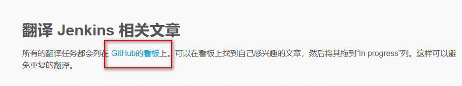
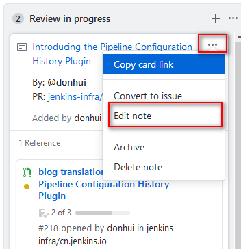
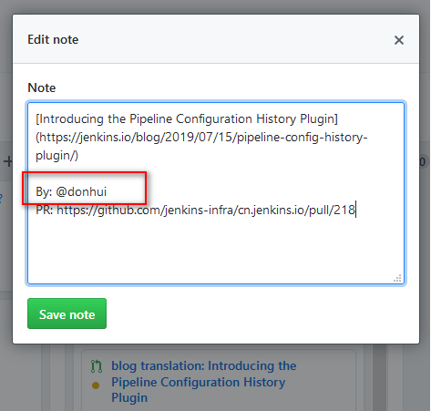
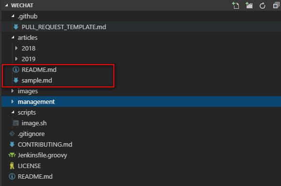

这里存放的是 Jenkins 官方微信公众号文章，文件采用 Markdown 格式，但包含一些必要的描述性字段。文章的校对、审核、排期等都通过 Pull Request 来完成。PR 合并后会发布到 [Jenkins 中文社区网站](https://jenkins-zh.cn/wechat/)。

# 基本要求 
有github 账号,会git 基本操作。

# 目录

文章以发布的排期来存放，层级为：年份/月份。如果月份为个位数的话，要以`0`开头，例如：`01`。

以文章的文件名前缀作为图片的目录，例如：文章的文件名为 `2019-01-01-sample.md`，我们需要在同级目录下创建文件夹 `2019-05-01-sample` ，
并在里面保存当前文章中的图片（封面、插图等）。

# 排期

为了尽可能满足你期望的发布日期，可以自行选择，但同时需要满足如下的条件：

* 为保障大家有足够的时间进行 Review，建议排到一周以后
* 工作日
* 避免同一天有相同[类型](https://github.com/jenkins-infra/wechat/tree/master/management/operators)的文章

# 文件名

文件名前缀为“年月日”，中间部分需要以英文来描述。例如：`2019-01-01-sample.md`。

# 字段

文件中的字段，是为了描述文章相关的必要信息。具体的说明请参考：[sample.md](sample.md)。

**翻译类**：

1、在看板上找到感兴趣的文章([任务看板地址](https://github.com/orgs/jenkins-zh/projects/2)	)

  

2、找管理员开通编辑看板功能 (管理员开通) 

3、待权限开通之后拖拽任务卡到 inProgress 列， 编辑note，将 by 属性改为自己github ID。

 

  

4、主要翻译标题+内容，参考[翻译规范](https://github.com/jenkins-zh/translation-spec/blob/master/specification.md)，超链接需要附上。

5、Fork[ weChart仓库](https://github.com/jenkins-infra/wechat)

6、克隆Fork后的weChart 到本地。

7、打开工程，请认仔细读工程中 README.md文档。里面有详细介绍了翻译后的文章要放在那里，怎么命名，Markdown格式问题等。

  

8、添加翻译的文章

9、提交、添加pull request。参考模板修改pr内容。

10、Review 后，可能需要些调整。直接本地修改后提交即可，不需要重新创建PR。
